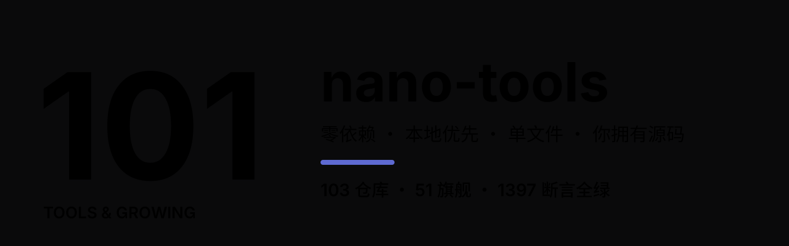
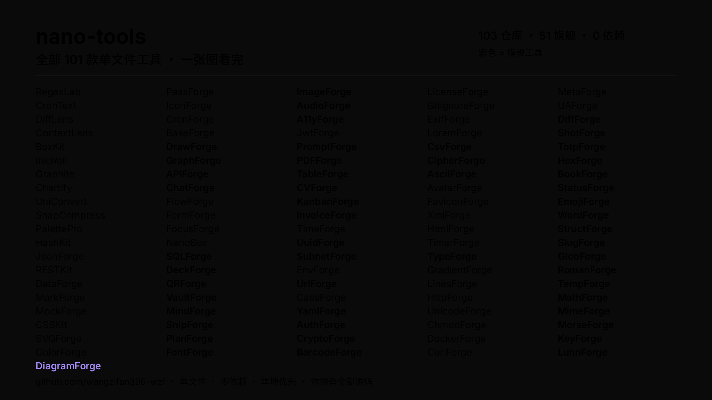

### 198 款单文件工具 · 零依赖 · 本地优先

    

**每工具独立仓库 · 单文件 HTML · 双击即开 · 断网可用 · 你拥有全部源码**

---

<i>全部 198 款单文件工具 — 紫色 = 旗舰工具</i>

---

## 旗舰工具（150 款）

<table>
<tr><th>工具</th><th>说明</th><th>试用</th></tr>
<tr><td><b>CronForge</b></td><td>Crontab 可视化：表达式解析成人话、预测未来 5 次运行、24 小时 + 7 天时刻表。</td><td><a href="https://wangzifan396-wzf.github.io/CronForge/">demo</a> / <a href="https://github.com/wangzifan396-wzf/CronForge">src</a></td></tr>
<tr><td><b>SnowflakeForge</b></td><td>Snowflake ID 工作台：BigInt 按 41 位时间戳 + 10 位机器 + 12 位序列拆解与合成，自定义 epoch 与数据中心位。</td><td><a href="https://wangzifan396-wzf.github.io/SnowflakeForge/">demo</a> / <a href="https://github.com/wangzifan396-wzf/SnowflakeForge">src</a></td></tr>
<tr><td><b>PunyForge</b></td><td>Punycode/IDN 转换：RFC 3492 编解码，中文等 Unicode 域名 ↔ xn-- ASCII 互转，逐标签处理。</td><td><a href="https://wangzifan396-wzf.github.io/PunyForge/">demo</a> / <a href="https://github.com/wangzifan396-wzf/PunyForge">src</a></td></tr>
<tr><td><b>ChangelogForge</b></td><td>Conventional Commits 解析：提交信息分组生成 CHANGELOG，breaking/feat/fix 自动推断下一个 SemVer 版本。</td><td><a href="https://wangzifan396-wzf.github.io/ChangelogForge/">demo</a> / <a href="https://github.com/wangzifan396-wzf/ChangelogForge">src</a></td></tr>
<tr><td><b>ULIDForge</b></td><td>ULID 生成与解码：Crockford Base32，48 位毫秒时间戳 + 80 位随机，可排序、可校验、可反解时间。</td><td><a href="https://wangzifan396-wzf.github.io/ULIDForge/">demo</a> / <a href="https://github.com/wangzifan396-wzf/ULIDForge">src</a></td></tr>
<tr><td><b>PasswordForge</b></td><td>安全口令生成器：可配字符集、避开易混字符（Il1O0o）、每类至少含一个，实时熵估计。</td><td><a href="https://wangzifan396-wzf.github.io/PasswordForge/">demo</a> / <a href="https://github.com/wangzifan396-wzf/PasswordForge">src</a></td></tr>
<tr><td><b>NumeralForge</b></td><td>数字转英文单词与人民币大写金额，支持负数与小数。</td><td><a href="https://wangzifan396-wzf.github.io/NumeralForge/">demo</a> / <a href="https://github.com/wangzifan396-wzf/NumeralForge">src</a></td></tr>
<tr><td><b>SparkForge</b></td><td>数据序列一键生成 SVG 迷你折线图与柱状图，纯函数返回 SVG 字符串。</td><td><a href="https://wangzifan396-wzf.github.io/SparkForge/">demo</a> / <a href="https://github.com/wangzifan396-wzf/SparkForge">src</a></td></tr>
<tr><td><b>FigletForge</b></td><td>文本转 ASCII 方块艺术字，内置字体、可自定义填充字符与间距。</td><td><a href="https://wangzifan396-wzf.github.io/FigletForge/">demo</a> / <a href="https://github.com/wangzifan396-wzf/FigletForge">src</a></td></tr>
<tr><td><b>HtmlEntityForge</b></td><td>HTML 实体编解码：命名/十进制/十六进制，XSS 安全转义。</td><td><a href="https://wangzifan396-wzf.github.io/HtmlEntityForge/">demo</a> / <a href="https://github.com/wangzifan396-wzf/HtmlEntityForge">src</a></td></tr>
<tr><td><b>UtmForge</b></td><td>UTM 参数构建、解析与校验，增长营销溯源。</td><td><a href="https://wangzifan396-wzf.github.io/UtmForge/">demo</a> / <a href="https://github.com/wangzifan396-wzf/UtmForge">src</a></td></tr>
<tr><td><b>InterestForge</b></td><td>复利终值与等额本息贷款摊销表计算。</td><td><a href="https://wangzifan396-wzf.github.io/InterestForge/">demo</a> / <a href="https://github.com/wangzifan396-wzf/InterestForge">src</a></td></tr>
<tr><td><b>MailForge</b></td><td>邮箱语法校验、解析与角色识别。</td><td><a href="https://wangzifan396-wzf.github.io/MailForge/">demo</a> / <a href="https://github.com/wangzifan396-wzf/MailForge">src</a></td></tr>
<tr><td><b>HashForge</b></td><td>哈希摘要校验器：纯 JS SHA-256/SHA-1/MD5，软件完整性校验。</td><td><a href="https://wangzifan396-wzf.github.io/HashForge/">demo</a> / <a href="https://github.com/wangzifan396-wzf/HashForge">src</a></td></tr>
<tr><td><b>BackoffForge</b></td><td>指数退避与抖动计算器：full/equal/decorrelated 策略，API 重试韧性。</td><td><a href="https://wangzifan396-wzf.github.io/BackoffForge/">demo</a> / <a href="https://github.com/wangzifan396-wzf/BackoffForge">src</a></td></tr>
<tr><td><b>UnitForge</b></td><td>通用单位换算：长度/质量/温度/速度/数据/面积/体积/时间/能量/压强。</td><td><a href="https://wangzifan396-wzf.github.io/UnitForge/">demo</a> / <a href="https://github.com/wangzifan396-wzf/UnitForge">src</a></td></tr>
<tr><td><b>ReadForge</b></td><td>文本可读性评分：Flesch Reading Ease 与 Flesch-Kincaid 年级，写作质量。</td><td><a href="https://wangzifan396-wzf.github.io/ReadForge/">demo</a> / <a href="https://github.com/wangzifan396-wzf/ReadForge">src</a></td></tr>
<tr><td><b>RateForge</b></td><td>限流算法模拟器：令牌桶与漏桶，refill/consume 纯函数推演，API 韧性设计。</td><td><a href="https://wangzifan396-wzf.github.io/RateForge/">demo</a> / <a href="https://github.com/wangzifan396-wzf/RateForge">src</a></td></tr>
<tr><td><b>BloomForge</b></td><td>布隆过滤器实验室：FNV-1a 双重哈希，误判率公式推演，海量去重利器。</td><td><a href="https://wangzifan396-wzf.github.io/BloomForge/">demo</a> / <a href="https://github.com/wangzifan396-wzf/BloomForge">src</a></td></tr>
<tr><td><b>HashRingForge</b></td><td>一致性哈希环：虚拟节点、增删节点迁移推演，分布式分片可视化。</td><td><a href="https://wangzifan396-wzf.github.io/HashRingForge/">demo</a> / <a href="https://github.com/wangzifan396-wzf/HashRingForge">src</a></td></tr>
<tr><td><b>LzwForge</b></td><td>LZW 压缩实验室：字典压缩/解压全程可视，压缩率实时对比。</td><td><a href="https://wangzifan396-wzf.github.io/LzwForge/">demo</a> / <a href="https://github.com/wangzifan396-wzf/LzwForge">src</a></td></tr>
<tr><td><b>VectorForge</b></td><td>向量相似度计算器：余弦/欧氏/曼哈顿/点积 + Top-K 检索，RAG 向量度量。</td><td><a href="https://wangzifan396-wzf.github.io/VectorForge/">demo</a> / <a href="https://github.com/wangzifan396-wzf/VectorForge">src</a></td></tr>
<tr><td><b>TopoForge</b></td><td>拓扑排序 / DAG 编排器：Kahn 算法 + 并行批次分层 + 环检测。</td><td><a href="https://wangzifan396-wzf.github.io/TopoForge/">demo</a> / <a href="https://github.com/wangzifan396-wzf/TopoForge">src</a></td></tr>
<tr><td><b>FuzzyForge</b></td><td>模糊匹配打分器：fzf 风格子序列匹配 + 边界加分 + 结果排序。</td><td><a href="https://wangzifan396-wzf.github.io/FuzzyForge/">demo</a> / <a href="https://github.com/wangzifan396-wzf/FuzzyForge">src</a></td></tr>
<tr><td><b>PivotForge</b></td><td>交叉表透视器：CSV 明细转行列交叉表，sum/count/avg/min/max + 总计。</td><td><a href="https://wangzifan396-wzf.github.io/PivotForge/">demo</a> / <a href="https://github.com/wangzifan396-wzf/PivotForge">src</a></td></tr>
<tr><td><b>MarkdownForge</b></td><td>Markdown 转 HTML 编译器：标题/列表/代码块/引用/链接，转义防注入。</td><td><a href="https://wangzifan396-wzf.github.io/MarkdownForge/">demo</a> / <a href="https://github.com/wangzifan396-wzf/MarkdownForge">src</a></td></tr>
<tr><td><b>PercentileForge</b></td><td>延迟分位数分析器：p50/p90/p95/p99 插值 + 标准差 + ASCII 直方图。</td><td><a href="https://wangzifan396-wzf.github.io/PercentileForge/">demo</a> / <a href="https://github.com/wangzifan396-wzf/PercentileForge">src</a></td></tr>
<tr><td><b>HmacForge</b></td><td>HMAC-SHA256 签名器：RFC 4231 向量验证，API 签名 / Webhook 校验。</td><td><a href="https://wangzifan396-wzf.github.io/HmacForge/">demo</a> / <a href="https://github.com/wangzifan396-wzf/HmacForge">src</a></td></tr>
<tr><td><b>MerkleForge</b></td><td>默克尔树构建与证明器：SHA-256 树 + 包含性证明 + 校验。</td><td><a href="https://wangzifan396-wzf.github.io/MerkleForge/">demo</a> / <a href="https://github.com/wangzifan396-wzf/MerkleForge">src</a></td></tr>
<tr><td><b>GeoForge</b></td><td>地理距离计算器：Haversine 大圆距离 + 方位角 + 目的地 + 包围盒。</td><td><a href="https://wangzifan396-wzf.github.io/GeoForge/">demo</a> / <a href="https://github.com/wangzifan396-wzf/GeoForge">src</a></td></tr>
<tr><td><b>CuckooForge</b></td><td>布谷鸟过滤器：可删除的概率型成员判定，指纹 + 双桶 + 踢出重放。</td><td><a href="https://wangzifan396-wzf.github.io/CuckooForge/">demo</a> / <a href="https://github.com/wangzifan396-wzf/CuckooForge">src</a></td></tr>
<tr><td><b>TokenForge</b></td><td>LLM Token 估算与成本计算器：确定性子词分词 + 多模型单价表。</td><td><a href="https://wangzifan396-wzf.github.io/TokenForge/">demo</a> / <a href="https://github.com/wangzifan396-wzf/TokenForge">src</a></td></tr>
<tr><td><b>SecretForge</b></td><td>密钥/凭据扫描器：正则模式 + 香农熵检测，定位代码中的高危泄露。</td><td><a href="https://wangzifan396-wzf.github.io/SecretForge/">demo</a> / <a href="https://github.com/wangzifan396-wzf/SecretForge">src</a></td></tr>
<tr><td><b>HllForge</b></td><td>HyperLogLog 基数估计：用极少内存估算大规模去重计数（至多高估）。</td><td><a href="https://wangzifan396-wzf.github.io/HllForge/">demo</a> / <a href="https://github.com/wangzifan396-wzf/HllForge">src</a></td></tr>
<tr><td><b>SketchForge</b></td><td>Count-Min Sketch 频次草图：流式频率估计，至多高估。</td><td><a href="https://wangzifan396-wzf.github.io/SketchForge/">demo</a> / <a href="https://github.com/wangzifan396-wzf/SketchForge">src</a></td></tr>
<tr><td><b>TrieForge</b></td><td>前缀树 Trie：自动补全、词表检索、前缀计数，零依赖纯函数。</td><td><a href="https://wangzifan396-wzf.github.io/TrieForge/">demo</a> / <a href="https://github.com/wangzifan396-wzf/TrieForge">src</a></td></tr>
<tr><td><b>LruForge</b></td><td>LRU 缓存：容量受限的 Least-Recently-Used 淘汰，Map 实现 O(1)。</td><td><a href="https://wangzifan396-wzf.github.io/LruForge/">demo</a> / <a href="https://github.com/wangzifan396-wzf/LruForge">src</a></td></tr>
<tr><td><b>UnionForge</b></td><td>并查集 Disjoint Set：连通分量、动态连通性、Kruskal 最小生成树。</td><td><a href="https://wangzifan396-wzf.github.io/UnionForge/">demo</a> / <a href="https://github.com/wangzifan396-wzf/UnionForge">src</a></td></tr>
<tr><td><b>BitsetForge</b></td><td>位集合 Bitset：紧凑位运算、集合交并差、成员判定与位计数。</td><td><a href="https://wangzifan396-wzf.github.io/BitsetForge/">demo</a> / <a href="https://github.com/wangzifan396-wzf/BitsetForge">src</a></td></tr>
<tr><td><b>BreakerForge</b></td><td>熔断器 Circuit Breaker：closed/open/half-open 状态机，保护下游服务。</td><td><a href="https://wangzifan396-wzf.github.io/BreakerForge/">demo</a> / <a href="https://github.com/wangzifan396-wzf/BreakerForge">src</a></td></tr>
<tr><td><b>ArgForge</b></td><td>命令行参数解析器：flags/options/positionals，类型推断与默认值。</td><td><a href="https://wangzifan396-wzf.github.io/ArgForge/">demo</a> / <a href="https://github.com/wangzifan396-wzf/ArgForge">src</a></td></tr>
<tr><td><b>Sha3Forge</b></td><td>SHA-3 / Keccak 哈希：自研 Keccak-f[1600]，SHA3-256/512 与 keccak256。</td><td><a href="https://wangzifan396-wzf.github.io/Sha3Forge/">demo</a> / <a href="https://github.com/wangzifan396-wzf/Sha3Forge">src</a></td></tr>
<tr><td><b>Base64Forge</b></td><td>Base64 编解码：标准 / URL-safe 双字母表，UTF-8 安全，宽松解码。</td><td><a href="https://wangzifan396-wzf.github.io/Base64Forge/">demo</a> / <a href="https://github.com/wangzifan396-wzf/Base64Forge">src</a></td></tr>
<tr><td><b>MsgpackForge</b></td><td>MessagePack 编解码：JSON 值到二进制紧凑序列化与十六进制视图。</td><td><a href="https://wangzifan396-wzf.github.io/MsgpackForge/">demo</a> / <a href="https://github.com/wangzifan396-wzf/MsgpackForge">src</a></td></tr>
<tr><td><b>PrngForge</b></td><td>可复现伪随机：mulberry32 / sfc32 / xoshiro128**，种子→序列/洗牌。</td><td><a href="https://wangzifan396-wzf.github.io/PrngForge/">demo</a> / <a href="https://github.com/wangzifan396-wzf/PrngForge">src</a></td></tr>
<tr><td><b>KmpForge</b></td><td>KMP 字符串匹配：失配表可视化，线性时间多次命中与高亮。</td><td><a href="https://wangzifan396-wzf.github.io/KmpForge/">demo</a> / <a href="https://github.com/wangzifan396-wzf/KmpForge">src</a></td></tr>
<tr><td><b>TarjanForge</b></td><td>Tarjan 强连通分量：一次 DFS 求 SCC，缩点 DAG 与环检测。</td><td><a href="https://wangzifan396-wzf.github.io/TarjanForge/">demo</a> / <a href="https://github.com/wangzifan396-wzf/TarjanForge">src</a></td></tr>
<tr><td><b>ExprForge</b></td><td>表达式求值器：调度场算法 + RPN，变量 / 函数，无 eval。</td><td><a href="https://wangzifan396-wzf.github.io/ExprForge/">demo</a> / <a href="https://github.com/wangzifan396-wzf/ExprForge">src</a></td></tr>
<tr><td><b>FenwickForge</b></td><td>树状数组：前缀和 / 区间和 / 单点更新 / 树上二分，O(log n)。</td><td><a href="https://wangzifan396-wzf.github.io/FenwickForge/">demo</a> / <a href="https://github.com/wangzifan396-wzf/FenwickForge">src</a></td></tr>
<tr><td><b>XxhashForge</b></td><td>xxHash32 快速哈希：官方向量验证，种子可调，非加密校验。</td><td><a href="https://wangzifan396-wzf.github.io/XxhashForge/">demo</a> / <a href="https://github.com/wangzifan396-wzf/XxhashForge">src</a></td></tr>
<tr><td><b>LinearForge</b></td><td>一元线性回归：最小二乘拟合、R²、残差与 RMSE、预测。</td><td><a href="https://wangzifan396-wzf.github.io/LinearForge/">demo</a> / <a href="https://github.com/wangzifan396-wzf/LinearForge">src</a></td></tr>
<tr><td><b>AstarForge</b></td><td>A* 网格寻路：曼哈顿启发式 + 路径回溯 + 扩展节点统计。</td><td><a href="https://wangzifan396-wzf.github.io/AstarForge/">demo</a> / <a href="https://github.com/wangzifan396-wzf/AstarForge">src</a></td></tr>
<tr><td><b>SegmentForge</b></td><td>线段树区间和/最值查询 + 懒标记区间加，O(log n)。</td><td><a href="https://wangzifan396-wzf.github.io/SegmentForge/">demo</a> / <a href="https://github.com/wangzifan396-wzf/SegmentForge">src</a></td></tr>
<tr><td><b>AvlForge</b></td><td>AVL 自平衡树：LL/RR/LR/RL 四旋转 + 平衡校验 + ASCII 树形。</td><td><a href="https://wangzifan396-wzf.github.io/AvlForge/">demo</a> / <a href="https://github.com/wangzifan396-wzf/AvlForge">src</a></td></tr>
<tr><td><b>RabinForge</b></td><td>Rabin-Karp 滚动哈希搜索：多模式 + 重叠命中 + 假阳性复核。</td><td><a href="https://wangzifan396-wzf.github.io/RabinForge/">demo</a> / <a href="https://github.com/wangzifan396-wzf/RabinForge">src</a></td></tr>
<tr><td><b>IntervalForge</b></td><td>区间合并/交集/最大不重叠调度/最少会议室，扫描线 + 贪心。</td><td><a href="https://wangzifan396-wzf.github.io/IntervalForge/">demo</a> / <a href="https://github.com/wangzifan396-wzf/IntervalForge">src</a></td></tr>
<tr><td><b>CombForge</b></td><td>BigInt 组合数学：nCr/nPr/阶乘/卡特兰数/帕斯卡三角，大数精确。</td><td><a href="https://wangzifan396-wzf.github.io/CombForge/">demo</a> / <a href="https://github.com/wangzifan396-wzf/CombForge">src</a></td></tr>
<tr><td><b>EloForge</b></td><td>Elo 等级分：期望胜率 + K 因子单局更新 + 批量对局推演。</td><td><a href="https://wangzifan396-wzf.github.io/EloForge/">demo</a> / <a href="https://github.com/wangzifan396-wzf/EloForge">src</a></td></tr>
<tr><td><b>Base85Forge</b></td><td>Ascii85 + Z85 编解码：z 压缩、尾组截断、RFC 向量校验。</td><td><a href="https://wangzifan396-wzf.github.io/Base85Forge/">demo</a> / <a href="https://github.com/wangzifan396-wzf/Base85Forge">src</a></td></tr>
<tr><td><b>SoundexForge</b></td><td>Soundex + Metaphone 语音编码：人名纠错与同音异拼分组。</td><td><a href="https://wangzifan396-wzf.github.io/SoundexForge/">demo</a> / <a href="https://github.com/wangzifan396-wzf/SoundexForge">src</a></td></tr>
<tr><td><b>StateForge</b></td><td>有限状态机：定义/事件推演/可达性/死状态检测。</td><td><a href="https://wangzifan396-wzf.github.io/StateForge/">demo</a> / <a href="https://github.com/wangzifan396-wzf/StateForge">src</a></td></tr>
<tr><td><b>MurmurForge</b></td><td>MurmurHash3 x86_32 哈希：UTF-8 输入、自定义种子、分桶路由。</td><td><a href="https://wangzifan396-wzf.github.io/MurmurForge/">demo</a> / <a href="https://github.com/wangzifan396-wzf/MurmurForge">src</a></td></tr>
<tr><td><b>Base32Forge</b></td><td>Base32 编解码：RFC4648 / Base32Hex / Crockford / z-base-32 四变体。</td><td><a href="https://wangzifan396-wzf.github.io/Base32Forge/">demo</a> / <a href="https://github.com/wangzifan396-wzf/Base32Forge">src</a></td></tr>
<tr><td><b>VarintForge</b></td><td>protobuf varint + ZigZag 变长整数编解码，hex 字节流互转。</td><td><a href="https://wangzifan396-wzf.github.io/VarintForge/">demo</a> / <a href="https://github.com/wangzifan396-wzf/VarintForge">src</a></td></tr>
<tr><td><b>GeohashForge</b></td><td>Geohash 编解码 + 8 邻居 + 包围盒，地理索引经典网格。</td><td><a href="https://wangzifan396-wzf.github.io/GeohashForge/">demo</a> / <a href="https://github.com/wangzifan396-wzf/GeohashForge">src</a></td></tr>
<tr><td><b>BenchForge</b></td><td>基准统计：mean/median/MAD/P95 + 离群点检测 + A/B 速度比。</td><td><a href="https://wangzifan396-wzf.github.io/BenchForge/">demo</a> / <a href="https://github.com/wangzifan396-wzf/BenchForge">src</a></td></tr>
<tr><td><b>DistForge</b></td><td>字符串距离六合一：Levenshtein/Damerau/Hamming/Jaro-Winkler/Dice。</td><td><a href="https://wangzifan396-wzf.github.io/DistForge/">demo</a> / <a href="https://github.com/wangzifan396-wzf/DistForge">src</a></td></tr>
<tr><td><b>MinhashForge</b></td><td>MinHash 签名 + Jaccard 估计：文档去重的核心草图。</td><td><a href="https://wangzifan396-wzf.github.io/MinhashForge/">demo</a> / <a href="https://github.com/wangzifan396-wzf/MinhashForge">src</a></td></tr>
<tr><td><b>SimhashForge</b></td><td>SimHash 64 位指纹 + 海明距离，近重复文本检测。</td><td><a href="https://wangzifan396-wzf.github.io/SimhashForge/">demo</a> / <a href="https://github.com/wangzifan396-wzf/SimhashForge">src</a></td></tr>
<tr><td><b>BktreeForge</b></td><td>BK 树容错查找：编辑距离三角不等式剪枝，拼写纠错索引。</td><td><a href="https://wangzifan396-wzf.github.io/BktreeForge/">demo</a> / <a href="https://github.com/wangzifan396-wzf/BktreeForge">src</a></td></tr>
<tr><td><b>SkipForge</b></td><td>跳表：种子化分层可复现，O(log n) 查找/插入/区间（Redis zset 内核）。</td><td><a href="https://wangzifan396-wzf.github.io/SkipForge/">demo</a> / <a href="https://github.com/wangzifan396-wzf/SkipForge">src</a></td></tr>
<tr><td><b>HuffmanForge</b></td><td>霍夫曼熵编码压缩器：基于字符频率的最优前缀码，无损还原。</td><td><a href="https://wangzifan396-wzf.github.io/HuffmanForge/">demo</a> / <a href="https://github.com/wangzifan396-wzf/HuffmanForge">src</a></td></tr>
<tr><td><b>CrcForge</b></td><td>CRC 校验和：CRC-32 与 CRC-16/CCITT 数据完整性校验。</td><td><a href="https://wangzifan396-wzf.github.io/CrcForge/">demo</a> / <a href="https://github.com/wangzifan396-wzf/CrcForge">src</a></td></tr>
<tr><td><b>Base58Forge</b></td><td>Base58 编解码器：Bitcoin 字母表，紧凑防误读字节编码。</td><td><a href="https://wangzifan396-wzf.github.io/Base58Forge/">demo</a> / <a href="https://github.com/wangzifan396-wzf/Base58Forge">src</a></td></tr>
<tr><td><b>MatrixForge</b></td><td>线性代数：矩阵加法 / 乘法 / 转置 / 行列式 / 逆矩阵。</td><td><a href="https://wangzifan396-wzf.github.io/MatrixForge/">demo</a> / <a href="https://github.com/wangzifan396-wzf/MatrixForge">src</a></td></tr>
<tr><td><b>TomlForge</b></td><td>TOML 解析器：字符串/数值/数组/表/数组表，零依赖解析。</td><td><a href="https://wangzifan396-wzf.github.io/TomlForge/">demo</a> / <a href="https://github.com/wangzifan396-wzf/TomlForge">src</a></td></tr>
<tr><td><b>HeapForge</b></td><td>二叉堆：最小/最大堆，可持久化插入与弹出，堆排序。</td><td><a href="https://wangzifan396-wzf.github.io/HeapForge/">demo</a> / <a href="https://github.com/wangzifan396-wzf/HeapForge">src</a></td></tr>
<tr><td><b>DijkstraForge</b></td><td>Dijkstra 最短路径：非负权重图单源最短路与路径还原。</td><td><a href="https://wangzifan396-wzf.github.io/DijkstraForge/">demo</a> / <a href="https://github.com/wangzifan396-wzf/DijkstraForge">src</a></td></tr>
<tr><td><b>AhoForge</b></td><td>Aho-Corasick 多模式匹配：一次扫描命中多串（含重叠）。</td><td><a href="https://wangzifan396-wzf.github.io/AhoForge/">demo</a> / <a href="https://github.com/wangzifan396-wzf/AhoForge">src</a></td></tr>
<tr><td><b>QsForge</b></td><td>URL 查询串：解析 / 序列化，重复键转数组，解码空格。</td><td><a href="https://wangzifan396-wzf.github.io/QsForge/">demo</a> / <a href="https://github.com/wangzifan396-wzf/QsForge">src</a></td></tr>
<tr><td><b>IniForge</b></td><td>INI 配置解析：section/键值/注释，与序列化互逆。</td><td><a href="https://wangzifan396-wzf.github.io/IniForge/">demo</a> / <a href="https://github.com/wangzifan396-wzf/IniForge">src</a></td></tr>
<tr><td><b>DrawForge</b></td><td>离线白板：手绘风画笔、矩形、椭圆、箭头、文本，自由平移缩放，一键导出 PNG/SVG，自动本地保存。</td><td><a href="https://wangzifan396-wzf.github.io/DrawForge/">demo</a> / <a href="https://github.com/wangzifan396-wzf/DrawForge">src</a></td></tr>
<tr><td><b>GraphForge</b></td><td>离线 Mermaid 图表编辑器：写 DSL 实时预览，一键导出 SVG/PNG，零依赖、数据永不离机。</td><td><a href="https://wangzifan396-wzf.github.io/GraphForge/">demo</a> / <a href="https://github.com/wangzifan396-wzf/GraphForge">src</a></td></tr>
<tr><td><b>APIForge</b></td><td>离线 REST / GraphQL 客户端：请求构建、Bearer/Basic 鉴权、响应计时与体积、历史记录，零依赖。</td><td><a href="https://wangzifan396-wzf.github.io/APIForge/">demo</a> / <a href="https://github.com/wangzifan396-wzf/APIForge">src</a></td></tr>
<tr><td><b>ChatForge</b></td><td>本地优先 BYOK AI 对话：自带密钥直连 OpenAI/Anthropic/OpenRouter，流式输出，密钥永不离机。</td><td><a href="https://wangzifan396-wzf.github.io/ChatForge/">demo</a> / <a href="https://github.com/wangzifan396-wzf/ChatForge">src</a></td></tr>
<tr><td><b>SQLForge</b></td><td>离线 SQL 数据库客户端：基于 SQLite(WASM) 运行真实 SQL，导入 CSV/JSON 建表，结果导出 CSV/JSON，零依赖、数据永不离机。</td><td><a href="https://wangzifan396-wzf.github.io/SQLForge/">demo</a> / <a href="https://github.com/wangzifan396-wzf/SQLForge">src</a></td></tr>
<tr><td><b>DeckForge</b></td><td>Markdown 一键变幻灯片：实时预览、键盘翻页、全屏演示、打印导出 PDF。离线、零依赖。</td><td><a href="https://wangzifan396-wzf.github.io/DeckForge/">demo</a> / <a href="https://github.com/wangzifan396-wzf/DeckForge">src</a></td></tr>
<tr><td><b>QRForge</b></td><td>纯前端二维码生成器：文本/网址/WiFi/名片，可调容错与配色，导出 SVG 与 PNG。真离线、零依赖。</td><td><a href="https://wangzifan396-wzf.github.io/QRForge/">demo</a> / <a href="https://github.com/wangzifan396-wzf/QRForge">src</a></td></tr>
<tr><td><b>VaultForge</b></td><td>本地优先的零知识加密密码库：AES-GCM + PBKDF2，登录/卡片/笔记/身份全加密，数据永不出端。</td><td><a href="https://wangzifan396-wzf.github.io/VaultForge/">demo</a> / <a href="https://github.com/wangzifan396-wzf/VaultForge">src</a></td></tr>
<tr><td><b>MindForge</b></td><td>本地优先思维导图编辑器：结构化节点树、自动布局、分支配色，导出 PNG/SVG/JSON，离线可用。</td><td><a href="https://wangzifan396-wzf.github.io/MindForge/">demo</a> / <a href="https://github.com/wangzifan396-wzf/MindForge">src</a></td></tr>
<tr><td><b>SnipForge</b></td><td>本地优先的代码片段管理器：分类、标签、全文搜索，一键复制，JSON 导入导出，离线可用。</td><td><a href="https://wangzifan396-wzf.github.io/SnipForge/">demo</a> / <a href="https://github.com/wangzifan396-wzf/SnipForge">src</a></td></tr>
<tr><td><b>PlanForge</b></td><td>本地优先甘特图 / 路线图规划器：任务、依赖、里程碑、进度追踪，导出 PNG/SVG/JSON，离线可用。</td><td><a href="https://wangzifan396-wzf.github.io/PlanForge/">demo</a> / <a href="https://github.com/wangzifan396-wzf/PlanForge">src</a></td></tr>
<tr><td><b>FontForge</b></td><td>字体预览与排版样张工作台：拖入字体即时渲染，调节字号 / 行高 / 字距 / 字重，字形表与可移植样张导出，本地优先。</td><td><a href="https://wangzifan396-wzf.github.io/FontForge/">demo</a> / <a href="https://github.com/wangzifan396-wzf/FontForge">src</a></td></tr>
<tr><td><b>ImageForge</b></td><td>离线图片编辑器：裁剪、缩放、旋转翻转、亮度 / 对比度 / 饱和度 / 色相 / 模糊调整、滤镜，导出 PNG/JPEG/WebP，零上传。</td><td><a href="https://wangzifan396-wzf.github.io/ImageForge/">demo</a> / <a href="https://github.com/wangzifan396-wzf/ImageForge">src</a></td></tr>
<tr><td><b>AudioForge</b></td><td>离线音频编辑器：加载音频、波形预览、裁剪、增益、淡入淡出、归一化、反转，导出 WAV，零上传。</td><td><a href="https://wangzifan396-wzf.github.io/AudioForge/">demo</a> / <a href="https://github.com/wangzifan396-wzf/AudioForge">src</a></td></tr>
<tr><td><b>A11yForge</b></td><td>离线无障碍工具箱：WCAG 对比度检查、合规取色、色盲模拟、HTML/ARIA 审计，零上传。</td><td><a href="https://wangzifan396-wzf.github.io/A11yForge/">demo</a> / <a href="https://github.com/wangzifan396-wzf/A11yForge">src</a></td></tr>
<tr><td><b>JwtForge</b></td><td>离线 JWT / Token 解码器：拆分 header、payload、signature，可读化 exp/nbf/iat，不校验签名。</td><td><a href="https://wangzifan396-wzf.github.io/JwtForge/">demo</a> / <a href="https://github.com/wangzifan396-wzf/JwtForge">src</a></td></tr>
<tr><td><b>PromptForge</b></td><td>本地优先 AI Prompt 工作台：变量模板、实时预览、BYOK 直连大模型、Token 与成本估算、本地历史，密钥永不离机。</td><td><a href="https://wangzifan396-wzf.github.io/PromptForge/">demo</a> / <a href="https://github.com/wangzifan396-wzf/PromptForge">src</a></td></tr>
<tr><td><b>PDFForge</b></td><td>本地优先 PDF 工具箱：合并、拆分、旋转、重排、优化重存，文件永不上传。</td><td><a href="https://wangzifan396-wzf.github.io/PDFForge/">demo</a> / <a href="https://github.com/wangzifan396-wzf/PDFForge">src</a></td></tr>
<tr><td><b>TableForge</b></td><td>离线表格工作台：粘贴 CSV/TSV/JSON 即解析，单元格编辑、增删行列、排序、筛选、分组聚合，导出 Markdown/HTML/JSON/CSV/TSV。</td><td><a href="https://wangzifan396-wzf.github.io/TableForge/">demo</a> / <a href="https://github.com/wangzifan396-wzf/TableForge">src</a></td></tr>
<tr><td><b>CVForge</b></td><td>离线简历 / CV 工作台：结构化表单 + 实时预览，三种模板，一键打印导出 PDF，JSON 导入导出，数据留本地。</td><td><a href="https://wangzifan396-wzf.github.io/CVForge/">demo</a> / <a href="https://github.com/wangzifan396-wzf/CVForge">src</a></td></tr>
<tr><td><b>KanbanForge</b></td><td>离线看板：多列拖拽卡片，优先级 / 标签 / 搜索筛选，导出 Markdown / JSON，数据永不离机。</td><td><a href="https://wangzifan396-wzf.github.io/KanbanForge/">demo</a> / <a href="https://github.com/wangzifan396-wzf/KanbanForge">src</a></td></tr>
<tr><td><b>InvoiceForge</b></td><td>离线发票 / 报价单生成器：行项目自动计税、人民币大写金额、A4 实时预览、一键打印导出 PDF。</td><td><a href="https://wangzifan396-wzf.github.io/InvoiceForge/">demo</a> / <a href="https://github.com/wangzifan396-wzf/InvoiceForge">src</a></td></tr>
<tr><td><b>UuidForge</b></td><td>离线 UUID / nanoid 生成器：v4 随机、v7 时间有序、v5 命名空间哈希（可复现）、批量生成与校验，数据永不离机。</td><td><a href="https://wangzifan396-wzf.github.io/UuidForge/">demo</a> / <a href="https://github.com/wangzifan396-wzf/UuidForge">src</a></td></tr>
<tr><td><b>SubnetForge</b></td><td>离线 IPv4/IPv6 CIDR 子网计算器：网络/广播地址、可用主机范围、子网拆分与归属判断，零上传。</td><td><a href="https://wangzifan396-wzf.github.io/SubnetForge/">demo</a> / <a href="https://github.com/wangzifan396-wzf/SubnetForge">src</a></td></tr>
<tr><td><b>UrlForge</b></td><td>离线 URL 工具箱：解析、编码/解码、查询参数构建与排序、Slug 生成、规范化，零上传。</td><td><a href="https://wangzifan396-wzf.github.io/UrlForge/">demo</a> / <a href="https://github.com/wangzifan396-wzf/UrlForge">src</a></td></tr>
<tr><td><b>YamlForge</b></td><td>离线 YAML ⇄ JSON 转换器：块级映射/序列、嵌套、类型推断、带引号标量，零上传。</td><td><a href="https://wangzifan396-wzf.github.io/YamlForge/">demo</a> / <a href="https://github.com/wangzifan396-wzf/YamlForge">src</a></td></tr>
<tr><td><b>AuthForge</b></td><td>离线 TOTP 身份验证器：自写 SHA1/HMAC-SHA1/RFC6238，生成 2FA 动态验证码与密钥，数据永不离机。</td><td><a href="https://wangzifan396-wzf.github.io/AuthForge/">demo</a> / <a href="https://github.com/wangzifan396-wzf/AuthForge">src</a></td></tr>
<tr><td><b>CryptoForge</b></td><td>本地 AES-GCM 加密与解密：Web Crypto + PBKDF2 派生密钥、随机盐与 IV 打包，敏感数据不出本机。</td><td><a href="https://wangzifan396-wzf.github.io/CryptoForge/">demo</a> / <a href="https://github.com/wangzifan396-wzf/CryptoForge">src</a></td></tr>
<tr><td><b>BarcodeForge</b></td><td>离线一维条码生成器：Code 128 / EAN-13 / UPC-A（含校验位），矢量 SVG 导出，零依赖。</td><td><a href="https://wangzifan396-wzf.github.io/BarcodeForge/">demo</a> / <a href="https://github.com/wangzifan396-wzf/BarcodeForge">src</a></td></tr>
<tr><td><b>CsvForge</b></td><td>离线 CSV 工具箱：解析 / 转 JSON / 转置 / 概览，零上传。</td><td><a href="https://wangzifan396-wzf.github.io/CsvForge/">demo</a> / <a href="https://github.com/wangzifan396-wzf/CsvForge">src</a></td></tr>
<tr><td><b>CipherForge</b></td><td>离线经典密码：凯撒 / 维吉尼亚 / ROT13 / Atbash，数据不出本机。</td><td><a href="https://wangzifan396-wzf.github.io/CipherForge/">demo</a> / <a href="https://github.com/wangzifan396-wzf/CipherForge">src</a></td></tr>
<tr><td><b>AsciiForge</b></td><td>离线 ASCII 艺术：A-Z 0-9 点阵横幅 / 文本框 / 黑客语转换。</td><td><a href="https://wangzifan396-wzf.github.io/AsciiForge/">demo</a> / <a href="https://github.com/wangzifan396-wzf/AsciiForge">src</a></td></tr>
<tr><td><b>TypeForge</b></td><td>离线 JSON → TypeScript 接口生成：嵌套对象展开、数组联合类型推断，零上传。</td><td><a href="https://wangzifan396-wzf.github.io/TypeForge/">demo</a> / <a href="https://github.com/wangzifan396-wzf/TypeForge">src</a></td></tr>
<tr><td><b>DiffForge</b></td><td>离线文本差异对比：基于 LCS 的行级 diff + 并排视图，统计增删，内置逐字符 inline diff。</td><td><a href="https://wangzifan396-wzf.github.io/DiffForge/">demo</a> / <a href="https://github.com/wangzifan396-wzf/DiffForge">src</a></td></tr>
<tr><td><b>ShotForge</b></td><td>离线代码截图生成器：轻量语法高亮 + 仿 macOS 窗口外观，一键复制 SVG / 导出 2x PNG。</td><td><a href="https://wangzifan396-wzf.github.io/ShotForge/">demo</a> / <a href="https://github.com/wangzifan396-wzf/ShotForge">src</a></td></tr>
<tr><td><b>TotpForge</b></td><td>离线 TOTP 身份验证器：纯 JS HMAC-SHA1（RFC 4226/6238 验证），Base32/ASCII 密钥，实时倒计时。</td><td><a href="https://wangzifan396-wzf.github.io/TotpForge/">demo</a> / <a href="https://github.com/wangzifan396-wzf/TotpForge">src</a></td></tr>
<tr><td><b>HexForge</b></td><td>离线十六进制查看器：文本(UTF-8)/十六进制/本地文件 → xxd 格式 dump，数据不出本机。</td><td><a href="https://wangzifan396-wzf.github.io/HexForge/">demo</a> / <a href="https://github.com/wangzifan396-wzf/HexForge">src</a></td></tr>
<tr><td><b>BookForge</b></td><td>离线书签生成器：粘贴 JavaScript 一键生成可拖入书签栏的 javascript: 书签，支持反向解析与语法校验。</td><td><a href="https://wangzifan396-wzf.github.io/BookForge/">demo</a> / <a href="https://github.com/wangzifan396-wzf/BookForge">src</a></td></tr>
<tr><td><b>StatusForge</b></td><td>离线 HTTP 状态码速查：覆盖 1xx–5xx 共 60+ 状态码，支持数字 / 关键词搜索与分类筛选。</td><td><a href="https://wangzifan396-wzf.github.io/StatusForge/">demo</a> / <a href="https://github.com/wangzifan396-wzf/StatusForge">src</a></td></tr>
<tr><td><b>EmojiForge</b></td><td>离线 emoji 速查：120+ 常用 emoji，按关键词或分组搜索，点击即复制并显示 Unicode 码位。</td><td><a href="https://wangzifan396-wzf.github.io/EmojiForge/">demo</a> / <a href="https://github.com/wangzifan396-wzf/EmojiForge">src</a></td></tr>
<tr><td><b>WordForge</b></td><td>离线文本统计：字符 / 词数 / 行数 / 句子 / 段落 / 阅读时长 + 高频英文词，中英文混排友好。</td><td><a href="https://wangzifan396-wzf.github.io/WordForge/">demo</a> / <a href="https://github.com/wangzifan396-wzf/WordForge">src</a></td></tr>
<tr><td><b>StructForge</b></td><td>离线结构生成：粘贴 JSON 一键转 TypeScript interface / Go struct / Python dataclass / JSON Schema，嵌套自动拆分。</td><td><a href="https://wangzifan396-wzf.github.io/StructForge/">demo</a> / <a href="https://github.com/wangzifan396-wzf/StructForge">src</a></td></tr>
<tr><td><b>SlugForge</b></td><td>离线 URL Slug 生成：变音符折叠（é→e、ß→ss）、可配置分隔符 / 大小写 / 长度，支持批量。</td><td><a href="https://wangzifan396-wzf.github.io/SlugForge/">demo</a> / <a href="https://github.com/wangzifan396-wzf/SlugForge">src</a></td></tr>
<tr><td><b>GlobForge</b></td><td>离线 Glob 模式测试：支持 * / ** / ? / [abc] / {a,b}，对一批路径实时匹配并统计命中数。</td><td><a href="https://wangzifan396-wzf.github.io/GlobForge/">demo</a> / <a href="https://github.com/wangzifan396-wzf/GlobForge">src</a></td></tr>
<tr><td><b>RomanForge</b></td><td>离线罗马数字：阿拉伯数字 ↔ 罗马数字互转，支持规范形校验，范围 1–3999。</td><td><a href="https://wangzifan396-wzf.github.io/RomanForge/">demo</a> / <a href="https://github.com/wangzifan396-wzf/RomanForge">src</a></td></tr>
<tr><td><b>TempForge</b></td><td>离线温度换算：摄氏度 / 华氏度 / 开尔文 / 兰氏度四标度互转，实时计算。</td><td><a href="https://wangzifan396-wzf.github.io/TempForge/">demo</a> / <a href="https://github.com/wangzifan396-wzf/TempForge">src</a></td></tr>
<tr><td><b>MathForge</b></td><td>离线数学表达式求值：安全无 eval，支持 + - * / ^ % 括号、函数与常量。</td><td><a href="https://wangzifan396-wzf.github.io/MathForge/">demo</a> / <a href="https://github.com/wangzifan396-wzf/MathForge">src</a></td></tr>
<tr><td><b>MimeForge</b></td><td>离线 MIME 类型查询：扩展名 ↔ MIME 双向，内置 ~70 条常用映射，可扩展。</td><td><a href="https://wangzifan396-wzf.github.io/MimeForge/">demo</a> / <a href="https://github.com/wangzifan396-wzf/MimeForge">src</a></td></tr>
<tr><td><b>MorseForge</b></td><td>离线莫尔斯电码：文本 ↔ 电码互转，自动识别方向，内置完整速查表可点击输入。</td><td><a href="https://wangzifan396-wzf.github.io/MorseForge/">demo</a> / <a href="https://github.com/wangzifan396-wzf/MorseForge">src</a></td></tr>
<tr><td><b>KeyForge</b></td><td>离线键盘按键侦测：实时显示 key / code / keyCode / 修饰键组合，支持键码反查。</td><td><a href="https://wangzifan396-wzf.github.io/KeyForge/">demo</a> / <a href="https://github.com/wangzifan396-wzf/KeyForge">src</a></td></tr>
<tr><td><b>LuhnForge</b></td><td>离线 Luhn 校验：银行卡号模 10 校验、卡组织识别（Visa/银联等）、校验位补全。</td><td><a href="https://wangzifan396-wzf.github.io/LuhnForge/">demo</a> / <a href="https://github.com/wangzifan396-wzf/LuhnForge">src</a></td></tr>
<tr><td><b>DiagramForge</b></td><td>离线流程图编辑器：节点+连线结构化绘图，4 种形状、拖拽连线、撤销重做、自动布局，导出 SVG/JSON。</td><td><a href="https://wangzifan396-wzf.github.io/DiagramForge/">demo</a> / <a href="https://github.com/wangzifan396-wzf/DiagramForge">src</a></td></tr>
<tr><td><b>CodeForge</b></td><td>离线前端游乐场：HTML/CSS/JS 三栏编辑 + 沙箱 iframe 实时预览 + 控制台捕获，可导出独立 HTML。</td><td><a href="https://wangzifan396-wzf.github.io/CodeForge/">demo</a> / <a href="https://github.com/wangzifan396-wzf/CodeForge">src</a></td></tr>
<tr><td><b>PixelForge</b></td><td>离线像素画 / 精灵图编辑器：画笔、橡皮、填充、取色、直线、矩形、X 轴镜像、网格缩放、24 色调色板、动画帧+洋葱皮+FPS 预览，导出 PNG@Nx 与雪碧图，localStorage 多项目管理。</td><td><a href="https://wangzifan396-wzf.github.io/PixelForge/">demo</a> / <a href="https://github.com/wangzifan396-wzf/PixelForge">src</a></td></tr>
<tr><td><b>GIFForge</b></td><td>离线 GIF 动画制作器：拖入图片或雪碧图切片成帧，拖拽排帧、逐帧延时、循环与抖动控制，纯 JS GIF89a 编码器（LZW+中位切分量化）本地导出。</td><td><a href="https://wangzifan396-wzf.github.io/GIFForge/">demo</a> / <a href="https://github.com/wangzifan396-wzf/GIFForge">src</a></td></tr>
<tr><td><b>MeshForge</b></td><td>离线 3D 模型查看器：拖入 OBJ / STL（二进制/ASCII 自动识别），WebGL 轨道渲染，着色/线框/点云三模式，坐标轴+网格+AABB 自动取景，PNG 快照导出。</td><td><a href="https://wangzifan396-wzf.github.io/MeshForge/">demo</a> / <a href="https://github.com/wangzifan396-wzf/MeshForge">src</a></td></tr>
<tr><td><b>RegexForge</b></td><td>离线正则测试与可视化：实时匹配高亮、捕获组与命名组、铁路图结构、速查表，一键导出匹配 JSON。</td><td><a href="https://wangzifan396-wzf.github.io/RegexForge/">demo</a> / <a href="https://github.com/wangzifan396-wzf/RegexForge">src</a></td></tr>
<tr><td><b>WhiteboardForge</b></td><td>离线无限画布白板：矩形/椭圆/线/箭头/自由笔/文字/便签，平移缩放、撤销重做、本地自动保存，导出 PNG 与 SVG。</td><td><a href="https://wangzifan396-wzf.github.io/WhiteboardForge/">demo</a> / <a href="https://github.com/wangzifan396-wzf/WhiteboardForge">src</a></td></tr>
<tr><td><b>SchemaForge</b></td><td>离线数据库建模 / ER 图设计器：可视化建表、外键关联，导出 MySQL / PostgreSQL / SQLite 多方言 SQL DDL 与 Mermaid。</td><td><a href="https://wangzifan396-wzf.github.io/SchemaForge/">demo</a> / <a href="https://github.com/wangzifan396-wzf/SchemaForge">src</a></td></tr>
<tr><td><b>ChartForge</b></td><td>离线数据图表生成器：粘贴 CSV / JSON / TSV，生成柱状 / 折线 / 饼 / 环形 / 散点 / 面积图，Canvas 渲染并导出 PNG 与 SVG。</td><td><a href="https://wangzifan396-wzf.github.io/ChartForge/">demo</a> / <a href="https://github.com/wangzifan396-wzf/ChartForge">src</a></td></tr>
<tr><td><b>BeautifyForge</b></td><td>离线代码美化与压缩：JavaScript / CSS / HTML / JSON 格式化与精简，字符串 / 注释 / 正则感知的 tokenizer，支持自动识别语言与实时字符统计。</td><td><a href="https://wangzifan396-wzf.github.io/BeautifyForge/">demo</a> / <a href="https://github.com/wangzifan396-wzf/BeautifyForge">src</a></td></tr>
<tr><td><b>SheetForge</b></td><td>离线迷你电子表格：A1 引用、区域、SUM / AVG / IF / ROUND 等公式引擎，依赖图重算与环检测，CSV 导入导出，零依赖。</td><td><a href="https://wangzifan396-wzf.github.io/SheetForge/">demo</a> / <a href="https://github.com/wangzifan396-wzf/SheetForge">src</a></td></tr>
<tr><td><b>TypingForge</b></td><td>离线打字速度测试：WPM / CPM / 准确率 / 稳定性，逐字符实时高亮，15/30/60 秒模式，可复现词表与本地最佳记录。</td><td><a href="https://wangzifan396-wzf.github.io/TypingForge/">demo</a> / <a href="https://github.com/wangzifan396-wzf/TypingForge">src</a></td></tr>
<tr><td><b>DateForge</b></td><td>离线日期计算器：日期间隔（年月日精确拆分）、加减推算、ISO 周 / 年积日 / 工作日、年龄与下次生日，纯整数序列算法无时区陷阱。</td><td><a href="https://wangzifan396-wzf.github.io/DateForge/">demo</a> / <a href="https://github.com/wangzifan396-wzf/DateForge">src</a></td></tr>
<tr><td><b>SemverForge</b></td><td>离线 SemVer 2.0.0 工具箱：版本解析校验、优先级比较排序、范围匹配（^ ~ x.* || 连字符）、bump 七种递增策略与版本差异判定。</td><td><a href="https://wangzifan396-wzf.github.io/SemverForge/">demo</a> / <a href="https://github.com/wangzifan396-wzf/SemverForge">src</a></td></tr>
<tr><td><b>HabitForge</b></td><td>离线习惯追踪器：每日打卡、当前 / 最长连击、近 30 天完成率、半年热力图，数据只存本地，支持 JSON 导入导出。</td><td><a href="https://wangzifan396-wzf.github.io/HabitForge/">demo</a> / <a href="https://github.com/wangzifan396-wzf/HabitForge">src</a></td></tr>
<tr><td><b>JsonPathForge</b></td><td>离线 JSONPath 查询器：自研解析器支持 $ . .. [*] [n] [切片] [?(@.x op v)] 过滤与正则匹配，实时高亮命中、输出规范化路径。</td><td><a href="https://wangzifan396-wzf.github.io/JsonPathForge/">demo</a> / <a href="https://github.com/wangzifan396-wzf/JsonPathForge">src</a></td></tr>
<tr><td><b>NginxForge</b></td><td>离线 Nginx 配置生成器：静态 / SPA / 反向代理 / 负载均衡四预设，HTTPS / HTTP2 / gzip / 安全头 / WebSocket / 限流一键生成，先校验后产出。</td><td><a href="https://wangzifan396-wzf.github.io/NginxForge/">demo</a> / <a href="https://github.com/wangzifan396-wzf/NginxForge">src</a></td></tr>
<tr><td><b>ColorBlindForge</b></td><td>离线色觉障碍模拟器：Machado 三型 + 全色盲模拟，sRGB↔Lab 转换、WCAG 对比度与 ΔE 审计，调色板无障碍检查。</td><td><a href="https://wangzifan396-wzf.github.io/ColorBlindForge/">demo</a> / <a href="https://github.com/wangzifan396-wzf/ColorBlindForge">src</a></td></tr>
</table>

---

## 全部工具按分类（198 款）

### 📝 文本处理

| 工具 | 说明 | 旗舰 |
|---|---|:---:|
| **RegexLab** | 正则表达式实时测试器：匹配高亮、捕获组、替换预览、14 组常用正则库与速查表。 |  |
| **DiffLens** | 基于 LCS 的文本 / JSON 差异对比，并排与内联双视图，JSON 规范化后按结构比对。 |  |
| **JsonForge** | JSON 工作台：格式化 / 压缩 / 校验、转 TypeScript 类型、JSONPath 查询、树形浏览。 |  |
| **DataForge** | JSON / CSV / TOML 三格式互转：嵌套表、数组表、标量数组均保留，实时转换、一键交换。 |  |
| **FigletForge** | 文本转 ASCII 方块艺术字，内置字体、可自定义填充字符与间距。 | ⭐ |
| **MailForge** | 邮箱语法校验、解析与角色识别。 | ⭐ |
| **ReadForge** | 文本可读性评分：Flesch Reading Ease 与 Flesch-Kincaid 年级，写作质量。 | ⭐ |
| **MarkdownForge** | Markdown 转 HTML 编译器：标题/列表/代码块/引用/链接，转义防注入。 | ⭐ |
| **SoundexForge** | Soundex + Metaphone 语音编码：人名纠错与同音异拼分组。 | ⭐ |
| **DistForge** | 字符串距离六合一：Levenshtein/Damerau/Hamming/Jaro-Winkler/Dice。 | ⭐ |
| **DiffForge** | 离线文本差异对比：基于 LCS 的行级 diff + 并排视图，统计增删，内置逐字符 inline diff。 | ⭐ |

### 🔧 开发辅助

| 工具 | 说明 | 旗舰 |
|---|---|:---:|
| **CronText** | Cron 表达式翻译成人话，并预测未来 8 次运行时间；内置常见调度示例库。 |  |
| **BoxKit** | 19 合 1 离线开发者工具箱：JSON/YAML、Base64、哈希、时间戳、正则、颜色等一站搞定。 |  |
| **RESTKit** | 离线 REST 客户端：请求构建、查询参数 / 头 / Body、Bearer/Basic 鉴权、响应计时与历史记录。 |  |
| **MockForge** | 假数据 / Mock 生成器：14 种字段类型、可复现种子，一键导出 JSON / CSV / SQL。 |  |
| **CronForge** | Crontab 可视化：表达式解析成人话、预测未来 5 次运行、24 小时 + 7 天时刻表。 | ⭐ |
| **SnowflakeForge** | Snowflake ID 工作台：BigInt 按 41 位时间戳 + 10 位机器 + 12 位序列拆解与合成，自定义 epoch 与数据中心位。 | ⭐ |
| **ChangelogForge** | Conventional Commits 解析：提交信息分组生成 CHANGELOG，breaking/feat/fix 自动推断下一个 SemVer 版本。 | ⭐ |
| **UtmForge** | UTM 参数构建、解析与校验，增长营销溯源。 | ⭐ |
| **BackoffForge** | 指数退避与抖动计算器：full/equal/decorrelated 策略，API 重试韧性。 | ⭐ |
| **RateForge** | 限流算法模拟器：令牌桶与漏桶，refill/consume 纯函数推演，API 韧性设计。 | ⭐ |
| **HashRingForge** | 一致性哈希环：虚拟节点、增删节点迁移推演，分布式分片可视化。 | ⭐ |
| **TopoForge** | 拓扑排序 / DAG 编排器：Kahn 算法 + 并行批次分层 + 环检测。 | ⭐ |
| **FuzzyForge** | 模糊匹配打分器：fzf 风格子序列匹配 + 边界加分 + 结果排序。 | ⭐ |
| **BreakerForge** | 熔断器 Circuit Breaker：closed/open/half-open 状态机，保护下游服务。 | ⭐ |
| **ArgForge** | 命令行参数解析器：flags/options/positionals，类型推断与默认值。 | ⭐ |
| **ExprForge** | 表达式求值器：调度场算法 + RPN，变量 / 函数，无 eval。 | ⭐ |
| **StateForge** | 有限状态机：定义/事件推演/可达性/死状态检测。 | ⭐ |
| **BenchForge** | 基准统计：mean/median/MAD/P95 + 离群点检测 + A/B 速度比。 | ⭐ |
| **QsForge** | URL 查询串：解析 / 序列化，重复键转数组，解码空格。 | ⭐ |
| **APIForge** | 离线 REST / GraphQL 客户端：请求构建、Bearer/Basic 鉴权、响应计时与体积、历史记录，零依赖。 | ⭐ |
| **ChmodForge** | 离线 UNIX 权限计算器：八进制 ↔ rwx 符号互转，支持 setuid/setgid/sticky。 |  |
| **DockerForge** | 离线 docker run → docker-compose.yml 转换：支持 30+ 参数，YAML 安全转义。 |  |
| **StructForge** | 离线结构生成：粘贴 JSON 一键转 TypeScript interface / Go struct / Python dataclass / JSON Schema，嵌套自动拆分。 | ⭐ |
| **GlobForge** | 离线 Glob 模式测试：支持 * / ** / ? / [abc] / {a,b}，对一批路径实时匹配并统计命中数。 | ⭐ |
| **MathForge** | 离线数学表达式求值：安全无 eval，支持 + - * / ^ % 括号、函数与常量。 | ⭐ |
| **MimeForge** | 离线 MIME 类型查询：扩展名 ↔ MIME 双向，内置 ~70 条常用映射，可扩展。 | ⭐ |
| **KeyForge** | 离线键盘按键侦测：实时显示 key / code / keyCode / 修饰键组合，支持键码反查。 | ⭐ |
| **LuhnForge** | 离线 Luhn 校验：银行卡号模 10 校验、卡组织识别（Visa/银联等）、校验位补全。 | ⭐ |
| **CodeForge** | 离线前端游乐场：HTML/CSS/JS 三栏编辑 + 沙箱 iframe 实时预览 + 控制台捕获，可导出独立 HTML。 | ⭐ |
| **RegexForge** | 离线正则测试与可视化：实时匹配高亮、捕获组与命名组、铁路图结构、速查表，一键导出匹配 JSON。 | ⭐ |
| **SchemaForge** | 离线数据库建模 / ER 图设计器：可视化建表、外键关联，导出 MySQL / PostgreSQL / SQLite 多方言 SQL DDL 与 Mermaid。 | ⭐ |
| **BeautifyForge** | 离线代码美化与压缩：JavaScript / CSS / HTML / JSON 格式化与精简，字符串 / 注释 / 正则感知的 tokenizer，支持自动识别语言与实时字符统计。 | ⭐ |
| **SemverForge** | 离线 SemVer 2.0.0 工具箱：版本解析校验、优先级比较排序、范围匹配（^ ~ x.* || 连字符）、bump 七种递增策略与版本差异判定。 | ⭐ |
| **NginxForge** | 离线 Nginx 配置生成器：静态 / SPA / 反向代理 / 负载均衡四预设，HTTPS / HTTP2 / gzip / 安全头 / WebSocket / 限流一键生成，先校验后产出。 | ⭐ |

### 🤖 AI 工具

| 工具 | 说明 | 旗舰 |
|---|---|:---:|
| **ContextLens** | LLM 上下文与成本可视化器：token 估算、多模型价格对比、上下文窗口占用分析。 |  |

### 📔 效率笔记

| 工具 | 说明 | 旗舰 |
|---|---|:---:|
| **Inkwell** | 本地优先 Markdown 知识库：双向链接、力导向关系图、实时预览，数据全存本地。 |  |
| **MarkForge** | Markdown 实时编辑器：边写边预览、快捷工具栏、导出独立 HTML、中英文字数统计。 |  |

### 📊 可视化

| 工具 | 说明 | 旗舰 |
|---|---|:---:|
| **Graphite** | SVG 可视化节点编辑器：拖拽连线、自动布局，导出 SVG / PNG / JSON / Markdown。 |  |
| **Chartify** | CSV / JSON 秒变 SVG 图表：柱状、折线、饼图，可导出矢量图，纯前端渲染。 |  |
| **SparkForge** | 数据序列一键生成 SVG 迷你折线图与柱状图，纯函数返回 SVG 字符串。 | ⭐ |
| **DrawForge** | 离线白板：手绘风画笔、矩形、椭圆、箭头、文本，自由平移缩放，一键导出 PNG/SVG，自动本地保存。 | ⭐ |
| **GraphForge** | 离线 Mermaid 图表编辑器：写 DSL 实时预览，一键导出 SVG/PNG，零依赖、数据永不离机。 | ⭐ |
| **MindForge** | 本地优先思维导图编辑器：结构化节点树、自动布局、分支配色，导出 PNG/SVG/JSON，离线可用。 | ⭐ |
| **DiagramForge** | 离线流程图编辑器：节点+连线结构化绘图，4 种形状、拖拽连线、撤销重做、自动布局，导出 SVG/JSON。 | ⭐ |

### 🎷️ 实用计算

| 工具 | 说明 | 旗舰 |
|---|---|:---:|
| **UniConvert** | 12 类万能单位换算：长度、重量、温度、数据、时间、货币格式等，实时联动。 |  |
| **NumeralForge** | 数字转英文单词与人民币大写金额，支持负数与小数。 | ⭐ |
| **InterestForge** | 复利终值与等额本息贷款摊销表计算。 | ⭐ |
| **UnitForge** | 通用单位换算：长度/质量/温度/速度/数据/面积/体积/时间/能量/压强。 | ⭐ |
| **VectorForge** | 向量相似度计算器：余弦/欧氏/曼哈顿/点积 + Top-K 检索，RAG 向量度量。 | ⭐ |
| **PercentileForge** | 延迟分位数分析器：p50/p90/p95/p99 插值 + 标准差 + ASCII 直方图。 | ⭐ |
| **GeoForge** | 地理距离计算器：Haversine 大圆距离 + 方位角 + 目的地 + 包围盒。 | ⭐ |
| **TokenForge** | LLM Token 估算与成本计算器：确定性子词分词 + 多模型单价表。 | ⭐ |
| **PrngForge** | 可复现伪随机：mulberry32 / sfc32 / xoshiro128**，种子→序列/洗牌。 | ⭐ |
| **LinearForge** | 一元线性回归：最小二乘拟合、R²、残差与 RMSE、预测。 | ⭐ |
| **IntervalForge** | 区间合并/交集/最大不重叠调度/最少会议室，扫描线 + 贪心。 | ⭐ |
| **CombForge** | BigInt 组合数学：nCr/nPr/阶乘/卡特兰数/帕斯卡三角，大数精确。 | ⭐ |
| **EloForge** | Elo 等级分：期望胜率 + K 因子单局更新 + 批量对局推演。 | ⭐ |
| **GeohashForge** | Geohash 编解码 + 8 邻居 + 包围盒，地理索引经典网格。 | ⭐ |
| **MatrixForge** | 线性代数：矩阵加法 / 乘法 / 转置 / 行列式 / 逆矩阵。 | ⭐ |
| **BaseForge** | 进制转换增强版：大整数（BigInt）、小数部分、自定义字符表（base62/58）、2–36 进制。 |  |
| **TimeForge** | 时间工具箱：Unix 时间戳 ⇄ 日期互转（自动识别秒/毫秒），6 时区对照，日期差与人性化时长计算。 |  |
| **EnvForge** | 离线 .env 解析 / 对比 / 校验器：变量引用展开、两份配置差异、必填项校验，纯本地。 |  |
| **TimerForge** | 离线秒表 / 倒计时：精确到 0.1 秒，支持秒或 mm:ss 输入。 |  |

### 🎷️ 图像工具

| 工具 | 说明 | 旗舰 |
|---|---|:---:|
| **SnapCompress** | 纯 Canvas 图片压缩：JPEG/PNG/WebP、质量与最大宽度可调、压缩前后实时对比。 |  |
| **SVGForge** | SVG 压缩优化器：去元数据、精简小数、实时预览体积对比，转 Data URI / CSS background。 |  |
| **PixelForge** | 离线像素画 / 精灵图编辑器：画笔、橡皮、填充、取色、直线、矩形、X 轴镜像、网格缩放、24 色调色板、动画帧+洋葱皮+FPS 预览，导出 PNG@Nx 与雪碧图，localStorage 多项目管理。 | ⭐ |
| **GIFForge** | 离线 GIF 动画制作器：拖入图片或雪碧图切片成帧，拖拽排帧、逐帧延时、循环与抖动控制，纯 JS GIF89a 编码器（LZW+中位切分量化）本地导出。 | ⭐ |
| **MeshForge** | 离线 3D 模型查看器：拖入 OBJ / STL（二进制/ASCII 自动识别），WebGL 轨道渲染，着色/线框/点云三模式，坐标轴+网格+AABB 自动取景，PNG 快照导出。 | ⭐ |

### 🎷️ 设计工具

| 工具 | 说明 | 旗舰 |
|---|---|:---:|
| **PalettePro** | 颜色 / 配色工作台：WCAG 对比度检测、和谐配色生成、渐变构造、取色板管理。 |  |
| **CSSKit** | CSS 游乐场：渐变、box-shadow、cubic-bezier 缓动曲线、Flex 布局，实时预览可复制。 |  |
| **ColorForge** | 颜色工作台：HEX/RGB/HSL 互转、和谐配色生成、WCAG 对比度检测与实时预览。 |  |
| **IconForge** | 线性图标工作台：17 款描边图标、可调描边色/粗细/尺寸/填充，一键复制或下载 SVG。 |  |
| **FontForge** | 字体预览与排版样张工作台：拖入字体即时渲染，调节字号 / 行高 / 字距 / 字重，字形表与可移植样张导出，本地优先。 | ⭐ |
| **ImageForge** | 离线图片编辑器：裁剪、缩放、旋转翻转、亮度 / 对比度 / 饱和度 / 色相 / 模糊调整、滤镜，导出 PNG/JPEG/WebP，零上传。 | ⭐ |
| **ColorBlindForge** | 离线色觉障碍模拟器：Machado 三型 + 全色盲模拟，sRGB↔Lab 转换、WCAG 对比度与 ΔE 审计，调色板无障碍检查。 | ⭐ |

### 🎷️ 编码加密

| 工具 | 说明 | 旗舰 |
|---|---|:---:|
| **HashKit** | 编码与哈希工具箱：Base64/URL/HTML 编解码、SHA 哈希、JWT 解码、UUID 与密码生成。 |  |
| **PassForge** | 密码 / 口令生成器：字符集与长度可调、Diceware 助记短语、熵值与强度评估。 |  |
| **PunyForge** | Punycode/IDN 转换：RFC 3492 编解码，中文等 Unicode 域名 ↔ xn-- ASCII 互转，逐标签处理。 | ⭐ |
| **ULIDForge** | ULID 生成与解码：Crockford Base32，48 位毫秒时间戳 + 80 位随机，可排序、可校验、可反解时间。 | ⭐ |
| **HtmlEntityForge** | HTML 实体编解码：命名/十进制/十六进制，XSS 安全转义。 | ⭐ |
| **HashForge** | 哈希摘要校验器：纯 JS SHA-256/SHA-1/MD5，软件完整性校验。 | ⭐ |
| **LzwForge** | LZW 压缩实验室：字典压缩/解压全程可视，压缩率实时对比。 | ⭐ |
| **HmacForge** | HMAC-SHA256 签名器：RFC 4231 向量验证，API 签名 / Webhook 校验。 | ⭐ |
| **SecretForge** | 密钥/凭据扫描器：正则模式 + 香农熵检测，定位代码中的高危泄露。 | ⭐ |
| **Sha3Forge** | SHA-3 / Keccak 哈希：自研 Keccak-f[1600]，SHA3-256/512 与 keccak256。 | ⭐ |
| **Base64Forge** | Base64 编解码：标准 / URL-safe 双字母表，UTF-8 安全，宽松解码。 | ⭐ |
| **XxhashForge** | xxHash32 快速哈希：官方向量验证，种子可调，非加密校验。 | ⭐ |
| **Base85Forge** | Ascii85 + Z85 编解码：z 压缩、尾组截断、RFC 向量校验。 | ⭐ |
| **MurmurForge** | MurmurHash3 x86_32 哈希：UTF-8 输入、自定义种子、分桶路由。 | ⭐ |
| **Base32Forge** | Base32 编解码：RFC4648 / Base32Hex / Crockford / z-base-32 四变体。 | ⭐ |
| **VarintForge** | protobuf varint + ZigZag 变长整数编解码，hex 字节流互转。 | ⭐ |
| **HuffmanForge** | 霍夫曼熵编码压缩器：基于字符频率的最优前缀码，无损还原。 | ⭐ |
| **CrcForge** | CRC 校验和：CRC-32 与 CRC-16/CCITT 数据完整性校验。 | ⭐ |
| **Base58Forge** | Base58 编解码器：Bitcoin 字母表，紧凑防误读字节编码。 | ⭐ |
| **JwtForge** | 离线 JWT / Token 解码器：拆分 header、payload、signature，可读化 exp/nbf/iat，不校验签名。 | ⭐ |
| **UuidForge** | 离线 UUID / nanoid 生成器：v4 随机、v7 时间有序、v5 命名空间哈希（可复现）、批量生成与校验，数据永不离机。 | ⭐ |
| **AuthForge** | 离线 TOTP 身份验证器：自写 SHA1/HMAC-SHA1/RFC6238，生成 2FA 动态验证码与密钥，数据永不离机。 | ⭐ |
| **CryptoForge** | 本地 AES-GCM 加密与解密：Web Crypto + PBKDF2 派生密钥、随机盐与 IV 打包，敏感数据不出本机。 | ⭐ |
| **LicenseForge** | 离线开源许可证生成器：MIT/BSD-3-Clause/ISC/Apache-2.0/Unlicense 全文，填充年份与版权人。 |  |
| **GitignoreForge** | 离线 .gitignore 模板组合器：21 种语言/框架/编辑器模板多选合并，带注释头，一键下载。 |  |
| **UnicodeForge** | 离线 Unicode 检查器：文本 ↔ \\uXXXX 转义、码点 U+、UTF-8 字节、HTML 实体互转。 |  |
| **TotpForge** | 离线 TOTP 身份验证器：纯 JS HMAC-SHA1（RFC 4226/6238 验证），Base32/ASCII 密钥，实时倒计时。 | ⭐ |
| **HexForge** | 离线十六进制查看器：文本(UTF-8)/十六进制/本地文件 → xxd 格式 dump，数据不出本机。 | ⭐ |

### 🎷️ 安全工具

| 工具 | 说明 | 旗舰 |
|---|---|:---:|
| **PasswordForge** | 安全口令生成器：可配字符集、避开易混字符（Il1O0o）、每类至少含一个，实时熵估计。 | ⭐ |
| **VaultForge** | 本地优先的零知识加密密码库：AES-GCM + PBKDF2，登录/卡片/笔记/身份全加密，数据永不出端。 | ⭐ |

### 🎷️ 数据结构

| 工具 | 说明 | 旗舰 |
|---|---|:---:|
| **BloomForge** | 布隆过滤器实验室：FNV-1a 双重哈希，误判率公式推演，海量去重利器。 | ⭐ |
| **MerkleForge** | 默克尔树构建与证明器：SHA-256 树 + 包含性证明 + 校验。 | ⭐ |
| **CuckooForge** | 布谷鸟过滤器：可删除的概率型成员判定，指纹 + 双桶 + 踢出重放。 | ⭐ |
| **HllForge** | HyperLogLog 基数估计：用极少内存估算大规模去重计数（至多高估）。 | ⭐ |
| **SketchForge** | Count-Min Sketch 频次草图：流式频率估计，至多高估。 | ⭐ |
| **TrieForge** | 前缀树 Trie：自动补全、词表检索、前缀计数，零依赖纯函数。 | ⭐ |
| **LruForge** | LRU 缓存：容量受限的 Least-Recently-Used 淘汰，Map 实现 O(1)。 | ⭐ |
| **UnionForge** | 并查集 Disjoint Set：连通分量、动态连通性、Kruskal 最小生成树。 | ⭐ |
| **BitsetForge** | 位集合 Bitset：紧凑位运算、集合交并差、成员判定与位计数。 | ⭐ |
| **KmpForge** | KMP 字符串匹配：失配表可视化，线性时间多次命中与高亮。 | ⭐ |
| **TarjanForge** | Tarjan 强连通分量：一次 DFS 求 SCC，缩点 DAG 与环检测。 | ⭐ |
| **FenwickForge** | 树状数组：前缀和 / 区间和 / 单点更新 / 树上二分，O(log n)。 | ⭐ |
| **AstarForge** | A* 网格寻路：曼哈顿启发式 + 路径回溯 + 扩展节点统计。 | ⭐ |
| **SegmentForge** | 线段树区间和/最值查询 + 懒标记区间加，O(log n)。 | ⭐ |
| **AvlForge** | AVL 自平衡树：LL/RR/LR/RL 四旋转 + 平衡校验 + ASCII 树形。 | ⭐ |
| **RabinForge** | Rabin-Karp 滚动哈希搜索：多模式 + 重叠命中 + 假阳性复核。 | ⭐ |
| **MinhashForge** | MinHash 签名 + Jaccard 估计：文档去重的核心草图。 | ⭐ |
| **SimhashForge** | SimHash 64 位指纹 + 海明距离，近重复文本检测。 | ⭐ |
| **BktreeForge** | BK 树容错查找：编辑距离三角不等式剪枝，拼写纠错索引。 | ⭐ |
| **SkipForge** | 跳表：种子化分层可复现，O(log n) 查找/插入/区间（Redis zset 内核）。 | ⭐ |
| **HeapForge** | 二叉堆：最小/最大堆，可持久化插入与弹出，堆排序。 | ⭐ |
| **DijkstraForge** | Dijkstra 最短路径：非负权重图单源最短路与路径还原。 | ⭐ |
| **AhoForge** | Aho-Corasick 多模式匹配：一次扫描命中多串（含重叠）。 | ⭐ |

### 🎷️ 数据工具

| 工具 | 说明 | 旗舰 |
|---|---|:---:|
| **PivotForge** | 交叉表透视器：CSV 明细转行列交叉表，sum/count/avg/min/max + 总计。 | ⭐ |
| **MsgpackForge** | MessagePack 编解码：JSON 值到二进制紧凑序列化与十六进制视图。 | ⭐ |
| **TomlForge** | TOML 解析器：字符串/数值/数组/表/数组表，零依赖解析。 | ⭐ |
| **IniForge** | INI 配置解析：section/键值/注释，与序列化互逆。 | ⭐ |
| **SQLForge** | 离线 SQL 数据库客户端：基于 SQLite(WASM) 运行真实 SQL，导入 CSV/JSON 建表，结果导出 CSV/JSON，零依赖、数据永不离机。 | ⭐ |
| **TableForge** | 离线表格工作台：粘贴 CSV/TSV/JSON 即解析，单元格编辑、增删行列、排序、筛选、分组聚合，导出 Markdown/HTML/JSON/CSV/TSV。 | ⭐ |
| **YamlForge** | 离线 YAML ⇄ JSON 转换器：块级映射/序列、嵌套、类型推断、带引号标量，零上传。 | ⭐ |
| **CsvForge** | 离线 CSV 工具箱：解析 / 转 JSON / 转置 / 概览，零上传。 | ⭐ |
| **XmlForge** | 离线 XML 工具：格式化缩进 / 结构校验（标签匹配闭合）。 |  |
| **ChartForge** | 离线数据图表生成器：粘贴 CSV / JSON / TSV，生成柱状 / 折线 / 饼 / 环形 / 散点 / 面积图，Canvas 渲染并导出 PNG 与 SVG。 | ⭐ |
| **SheetForge** | 离线迷你电子表格：A1 引用、区域、SUM / AVG / IF / ROUND 等公式引擎，依赖图重算与环检测，CSV 导入导出，零依赖。 | ⭐ |
| **JsonPathForge** | 离线 JSONPath 查询器：自研解析器支持 $ . .. [*] [n] [切片] [?(@.x op v)] 过滤与正则匹配，实时高亮命中、输出规范化路径。 | ⭐ |

### 🎷️ AI 效率

| 工具 | 说明 | 旗舰 |
|---|---|:---:|
| **ChatForge** | 本地优先 BYOK AI 对话：自带密钥直连 OpenAI/Anthropic/OpenRouter，流式输出，密钥永不离机。 | ⭐ |
| **PromptForge** | 本地优先 AI Prompt 工作台：变量模板、实时预览、BYOK 直连大模型、Token 与成本估算、本地历史，密钥永不离机。 | ⭐ |

### 📋 任务管理

| 工具 | 说明 | 旗舰 |
|---|---|:---:|
| **FlowForge** | 本地优先离线看板：多看板、拖拽排序、标签/优先级/截止、清单子任务，数据留在浏览器。 |  |

### ⚡ 效率工具

| 工具 | 说明 | 旗舰 |
|---|---|:---:|
| **FormForge** | 本地优先离线表单构建器：拖拽式字段、实时预览，一键导出独立 HTML 或 JSON Schema。 |  |
| **FocusForge** | 本地优先的专注与计时工具箱：番茄钟、倒计时、秒表、世界时钟，数据留在浏览器。 |  |
| **DeckForge** | Markdown 一键变幻灯片：实时预览、键盘翻页、全屏演示、打印导出 PDF。离线、零依赖。 | ⭐ |
| **CVForge** | 离线简历 / CV 工作台：结构化表单 + 实时预览，三种模板，一键打印导出 PDF，JSON 导入导出，数据留本地。 | ⭐ |
| **KanbanForge** | 离线看板：多列拖拽卡片，优先级 / 标签 / 搜索筛选，导出 Markdown / JSON，数据永不离机。 | ⭐ |
| **InvoiceForge** | 离线发票 / 报价单生成器：行项目自动计税、人民币大写金额、A4 实时预览、一键打印导出 PDF。 | ⭐ |
| **TypingForge** | 离线打字速度测试：WPM / CPM / 准确率 / 稳定性，逐字符实时高亮，15/30/60 秒模式，可复现词表与本地最佳记录。 | ⭐ |
| **DateForge** | 离线日期计算器：日期间隔（年月日精确拆分）、加减推算、ISO 周 / 年积日 / 工作日、年龄与下次生日，纯整数序列算法无时区陷阱。 | ⭐ |
| **HabitForge** | 离线习惯追踪器：每日打卡、当前 / 最长连击、近 30 天完成率、半年热力图，数据只存本地，支持 JSON 导入导出。 | ⭐ |

### 🛠️ 聚合器

| 工具 | 说明 | 旗舰 |
|---|---|:---:|
| **NanoBox** | 单文件工具中枢：模糊搜索全部 nano-tools，内联安全表达式计算器，一键在 iframe 中打开。本地优先、零依赖。 |  |

### 🎷️ 编码工具

| 工具 | 说明 | 旗舰 |
|---|---|:---:|
| **QRForge** | 纯前端二维码生成器：文本/网址/WiFi/名片，可调容错与配色，导出 SVG 与 PNG。真离线、零依赖。 | ⭐ |

### 🎷️ 效率

| 工具 | 说明 | 旗舰 |
|---|---|:---:|
| **SnipForge** | 本地优先的代码片段管理器：分类、标签、全文搜索，一键复制，JSON 导入导出，离线可用。 | ⭐ |
| **PlanForge** | 本地优先甘特图 / 路线图规划器：任务、依赖、里程碑、进度追踪，导出 PNG/SVG/JSON，离线可用。 | ⭐ |

### 🎷️ 媒体工具

| 工具 | 说明 | 旗舰 |
|---|---|:---:|
| **AudioForge** | 离线音频编辑器：加载音频、波形预览、裁剪、增益、淡入淡出、归一化、反转，导出 WAV，零上传。 | ⭐ |

### 🎷️ 开发工具

| 工具 | 说明 | 旗舰 |
|---|---|:---:|
| **A11yForge** | 离线无障碍工具箱：WCAG 对比度检查、合规取色、色盲模拟、HTML/ARIA 审计，零上传。 | ⭐ |

### 🎷️ 图像与媒体

| 工具 | 说明 | 旗舰 |
|---|---|:---:|
| **PDFForge** | 本地优先 PDF 工具箱：合并、拆分、旋转、重排、优化重存，文件永不上传。 | ⭐ |

### 🎷️ 网络

| 工具 | 说明 | 旗舰 |
|---|---|:---:|
| **SubnetForge** | 离线 IPv4/IPv6 CIDR 子网计算器：网络/广播地址、可用主机范围、子网拆分与归属判断，零上传。 | ⭐ |
| **UrlForge** | 离线 URL 工具箱：解析、编码/解码、查询参数构建与排序、Slug 生成、规范化，零上传。 | ⭐ |
| **HttpForge** | 离线 HTTP 速查：状态码（1xx-5xx 可搜索）/ 请求方法特性 / 常见 MIME 类型。 |  |
| **CurlForge** | 离线 curl 命令生成器：method / headers / body / 认证可视化配置，粘贴即用。 |  |
| **UAForge** | 离线 User-Agent 解析器：浏览器 / 内核 / 系统 / 设备类型识别，含爬虫检测。 |  |
| **BookForge** | 离线书签生成器：粘贴 JavaScript 一键生成可拖入书签栏的 javascript: 书签，支持反向解析与语法校验。 | ⭐ |
| **StatusForge** | 离线 HTTP 状态码速查：覆盖 1xx–5xx 共 60+ 状态码，支持数字 / 关键词搜索与分类筛选。 | ⭐ |

### 🎷️ 文本

| 工具 | 说明 | 旗舰 |
|---|---|:---:|
| **CaseForge** | 离线文本大小写转换与行工具：camelCase/snake_case/kebab-case 等、去重、排序、加前缀与行号。 |  |
| **LoremForge** | 离线 Lorem ipsum 占位文本生成器：可复现种子、段落/句数可调、可选 Lorem 开头与纯词数模式。 |  |
| **AsciiForge** | 离线 ASCII 艺术：A-Z 0-9 点阵横幅 / 文本框 / 黑客语转换。 | ⭐ |
| **LinesForge** | 离线文本行工具箱：去重 / 排序 / 删空行 / 加行号 / 反转，实时统计。 |  |
| **EmojiForge** | 离线 emoji 速查：120+ 常用 emoji，按关键词或分组搜索，点击即复制并显示 Unicode 码位。 | ⭐ |
| **WordForge** | 离线文本统计：字符 / 词数 / 行数 / 句子 / 段落 / 阅读时长 + 高频英文词，中英文混排友好。 | ⭐ |
| **SlugForge** | 离线 URL Slug 生成：变音符折叠（é→e、ß→ss）、可配置分隔符 / 大小写 / 长度，支持批量。 | ⭐ |
| **RomanForge** | 离线罗马数字：阿拉伯数字 ↔ 罗马数字互转，支持规范形校验，范围 1–3999。 | ⭐ |
| **TempForge** | 离线温度换算：摄氏度 / 华氏度 / 开尔文 / 兰氏度四标度互转，实时计算。 | ⭐ |
| **MorseForge** | 离线莫尔斯电码：文本 ↔ 电码互转，自动识别方向，内置完整速查表可点击输入。 | ⭐ |

### 🎷️ 设计创意

| 工具 | 说明 | 旗舰 |
|---|---|:---:|
| **BarcodeForge** | 离线一维条码生成器：Code 128 / EAN-13 / UPC-A（含校验位），矢量 SVG 导出，零依赖。 | ⭐ |
| **ExifForge** | 离线图片 EXIF 元数据查看与清除：解析 JPEG APP1 / TIFF IFD，一键剥离拍摄隐私信息。 |  |
| **AvatarForge** | 离线身份图标：种子文本生成确定性 identicon（SVG），零上传。 |  |
| **FaviconForge** | 离线 Favicon 生成：文字 / Emoji → SVG，自定义配色。 |  |
| **GradientForge** | 离线 CSS 渐变构建器：线性 / 径向 / 锥形，多色标实时预览，一键复制 CSS。 |  |
| **WhiteboardForge** | 离线无限画布白板：矩形/椭圆/线/箭头/自由笔/文字/便签，平移缩放、撤销重做、本地自动保存，导出 PNG 与 SVG。 | ⭐ |

### 🎷️ 安全

| 工具 | 说明 | 旗舰 |
|---|---|:---:|
| **CipherForge** | 离线经典密码：凯撒 / 维吉尼亚 / ROT13 / Atbash，数据不出本机。 | ⭐ |

### 🎷️ 开发

| 工具 | 说明 | 旗舰 |
|---|---|:---:|
| **HtmlForge** | 离线 HTML 工具：压缩 / 格式化 / 转义反转义，零依赖。 |  |
| **TypeForge** | 离线 JSON → TypeScript 接口生成：嵌套对象展开、数组联合类型推断，零上传。 | ⭐ |
| **MetaForge** | 离线 Meta 标签生成器：基础 + Open Graph + Twitter Card 全套，SEO 长度检查。 |  |
| **ShotForge** | 离线代码截图生成器：轻量语法高亮 + 仿 macOS 窗口外观，一键复制 SVG / 导出 2x PNG。 | ⭐ |

---

## 设计原则

- **零依赖 · 单文件** —— 每个 `index.html` 双击即开，可随身携带
- **本地优先** —— 无外部请求，断网可用，数据永不离机
- **隐私第一** —— 全部浏览器内计算，不传任何数据到服务器
- **统一设计系统** —— Linear 冷峻暗色，克制动效，系统字体栈
- **测试驱动** —— 纯函数单测 + jsdom 功能测试，全绿才发布

**MIT Licensed** · 欢迎 Star ⭐ / Fork / PR

