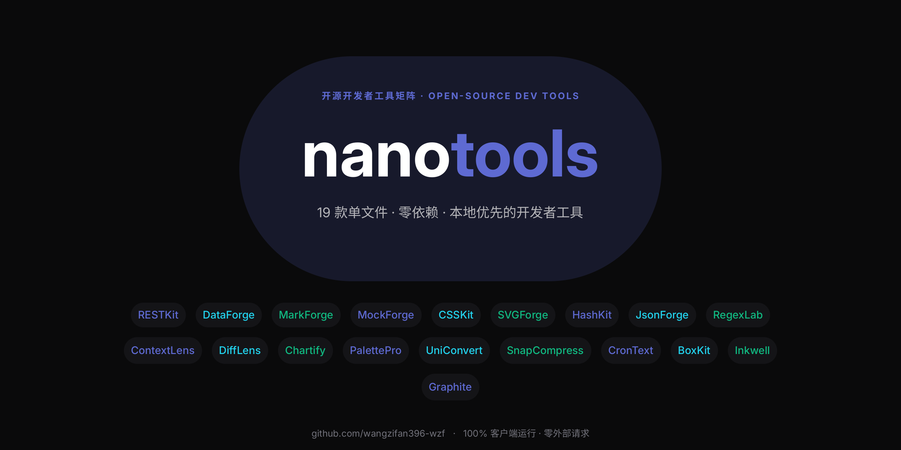

 

**一个标签页，收纳你全部的开发者工具。**
19 个单文件、零依赖、本地优先的开源工具 —— 双击即开，数据永不离机。

### 👉 [**打开 nano-tools 门户**](https://wangzifan396-wzf.github.io/WB/) &nbsp;·&nbsp; 一站浏览全部工具

---

## 🧰 全部工具

### 🛠 开发辅助
| 工具 | 说明 | 试用 | 源码 |
|---|---|:---:|:---:|
| **RESTKit** `新` | 离线 REST 客户端：鉴权 / 计时 / 历史 | [demo](https://wangzifan396-wzf.github.io/RESTKit/) | [repo](https://github.com/wangzifan396-wzf/RESTKit) |
| **MockForge** `新` | 假数据生成器：14 种字段 → JSON/CSV/SQL | [demo](https://wangzifan396-wzf.github.io/MockForge/) | [repo](https://github.com/wangzifan396-wzf/MockForge) |
| **CronText** | Cron 表达式翻译成人话 + 预测运行时间 | [demo](https://wangzifan396-wzf.github.io/CronText/) | [repo](https://github.com/wangzifan396-wzf/CronText) |
| **BoxKit** | 19 合 1 离线开发者工具箱 | [demo](https://wangzifan396-wzf.github.io/BoxKit/) | [repo](https://github.com/wangzifan396-wzf/BoxKit) |

### 📝 文本处理
| 工具 | 说明 | 试用 | 源码 |
|---|---|:---:|:---:|
| **DataForge** `新` | JSON / CSV / TOML 三格式互转 | [demo](https://wangzifan396-wzf.github.io/DataForge/) | [repo](https://github.com/wangzifan396-wzf/DataForge) |
| **JsonForge** | JSON 工作台：格式化 / TS 类型 / JSONPath | [demo](https://wangzifan396-wzf.github.io/JsonForge/) | [repo](https://github.com/wangzifan396-wzf/JsonForge) |
| **RegexLab** | 正则实时测试器 + 常用正则库 | [demo](https://wangzifan396-wzf.github.io/RegexLab/) | [repo](https://github.com/wangzifan396-wzf/RegexLab) |
| **DiffLens** | 文本 / JSON 差异对比（LCS） | [demo](https://wangzifan396-wzf.github.io/DiffLens/) | [repo](https://github.com/wangzifan396-wzf/DiffLens) |

### 🎨 设计 & 图像
| 工具 | 说明 | 试用 | 源码 |
|---|---|:---:|:---:|
| **CSSKit** `新` | CSS 游乐场：渐变 / 阴影 / 缓动 / Flex | [demo](https://wangzifan396-wzf.github.io/CSSKit/) | [repo](https://github.com/wangzifan396-wzf/CSSKit) |
| **SVGForge** `新` | SVG 压缩优化 + 转 Data URI / CSS | [demo](https://wangzifan396-wzf.github.io/SVGForge/) | [repo](https://github.com/wangzifan396-wzf/SVGForge) |
| **PalettePro** | 配色工作台：WCAG 对比度 / 渐变 / 取色 | [demo](https://wangzifan396-wzf.github.io/PalettePro/) | [repo](https://github.com/wangzifan396-wzf/PalettePro) |
| **SnapCompress** | 纯 Canvas 图片压缩（JPEG/PNG/WebP） | [demo](https://wangzifan396-wzf.github.io/SnapCompress/) | [repo](https://github.com/wangzifan396-wzf/SnapCompress) |

### 📊 可视化 & 笔记
| 工具 | 说明 | 试用 | 源码 |
|---|---|:---:|:---:|
| **MarkForge** `新` | Markdown 实时编辑器 + 导出 HTML | [demo](https://wangzifan396-wzf.github.io/MarkForge/) | [repo](https://github.com/wangzifan396-wzf/MarkForge) |
| **Graphite** | SVG 可视化节点编辑器 | [demo](https://wangzifan396-wzf.github.io/Graphite/) | [repo](https://github.com/wangzifan396-wzf/Graphite) |
| **Chartify** | CSV / JSON 秒变 SVG 图表 | [demo](https://wangzifan396-wzf.github.io/Chartify/) | [repo](https://github.com/wangzifan396-wzf/Chartify) |
| **Inkwell** | 本地优先 Markdown 知识库 + 关系图 | [demo](https://wangzifan396-wzf.github.io/Inkwell/) | [repo](https://github.com/wangzifan396-wzf/Inkwell) |

### 🔐 编码 · 计算 · AI
| 工具 | 说明 | 试用 | 源码 |
|---|---|:---:|:---:|
| **HashKit** | 编码 / 哈希 / JWT / UUID 工具箱 | [demo](https://wangzifan396-wzf.github.io/HashKit/) | [repo](https://github.com/wangzifan396-wzf/HashKit) |
| **UniConvert** | 12 类万能单位换算 | [demo](https://wangzifan396-wzf.github.io/UniConvert/) | [repo](https://github.com/wangzifan396-wzf/UniConvert) |
| **ContextLens** | LLM 上下文与成本可视化 | [demo](https://wangzifan396-wzf.github.io/ContextLens/) | [repo](https://github.com/wangzifan396-wzf/ContextLens) |

---

## ✨ 设计原则

- **零依赖 · 单文件** —— 每个工具就是一个 `index.html`，双击即开，可随身携带。
- **本地优先** —— 全部计算在浏览器内完成，不引用任何外部字体 / 脚本 / 网络接口，断网可用。
- **隐私第一** —— 你的数据永远留在你的设备上。
- **统一设计系统** —— Linear 冷峻暗色、明暗主题、克制的动效。
- **测试驱动** —— 每个工具都有纯函数单测 + jsdom 功能测试，全绿才发布。

**MIT Licensed** · 欢迎 Star ⭐ / Fork / PR

