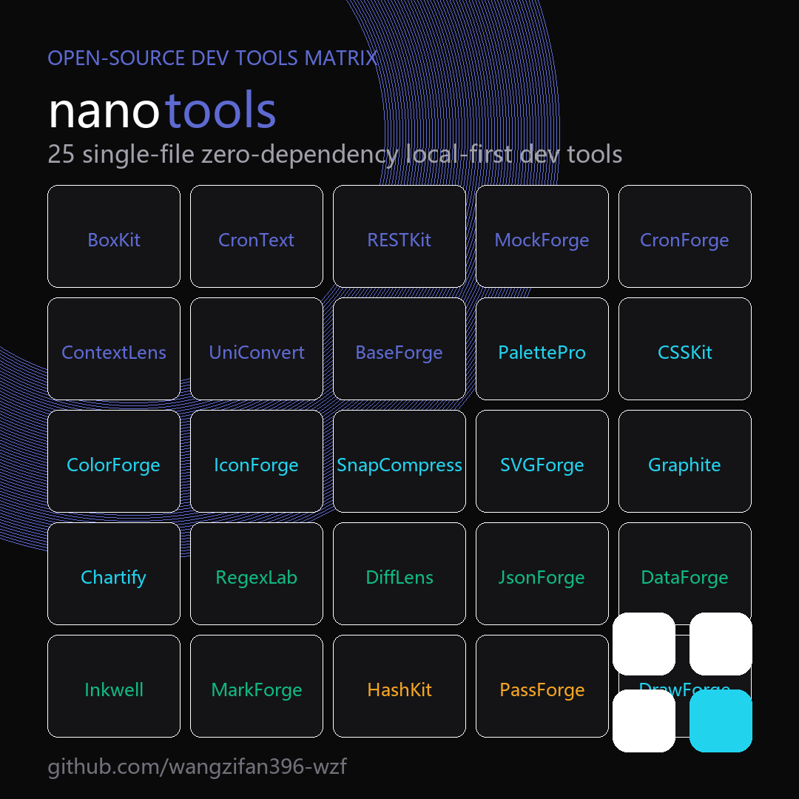

 

**一个标签页，收纳你全部的开发者工具。**
32 个单文件、零依赖、本地优先的开源工具 —— 双击即开，数据永不离机。

### 👉 [**打开 nano-tools 门户**](https://wangzifan396-wzf.github.io/WB/) &nbsp;·&nbsp; 一站浏览全部工具

 

### 🗺 工具地图

> nano-tools 工具地图（代表性一览）· 点击进入 [nano-tools 门户](https://wangzifan396-wzf.github.io/WB/) 试用全部 32 款单文件工具。

---

## 🧰 全部工具（32 款）

### 🛠 开发辅助
| 工具 | 说明 | 试用 | 源码 |
|---|---|:---:|:---:|
| **CronForge** | Crontab 可视化：人话描述 + 时刻表 + 预测 | [demo](https://wangzifan396-wzf.github.io/CronForge/) | [repo](https://github.com/wangzifan396-wzf/CronForge) |
| **RESTKit** | 离线 REST 客户端：鉴权 / 计时 / 历史 | [demo](https://wangzifan396-wzf.github.io/RESTKit/) | [repo](https://github.com/wangzifan396-wzf/RESTKit) |
| **MockForge** | 假数据生成器：14 种字段 → JSON/CSV/SQL | [demo](https://wangzifan396-wzf.github.io/MockForge/) | [repo](https://github.com/wangzifan396-wzf/MockForge) |
| **CronText** | Cron 表达式翻译成人话 + 预测运行时间 | [demo](https://wangzifan396-wzf.github.io/CronText/) | [repo](https://github.com/wangzifan396-wzf/CronText) |
| **BoxKit** | 19 合 1 离线开发者工具箱 | [demo](https://wangzifan396-wzf.github.io/BoxKit/) | [repo](https://github.com/wangzifan396-wzf/BoxKit) |
| **APIForge** `新` | 离线 REST / GraphQL 客户端：请求构建、Bearer/Basic 鉴权、响应计时 | [demo](https://wangzifan396-wzf.github.io/APIForge/) | [repo](https://github.com/wangzifan396-wzf/APIForge) |

### 📝 文本处理
| 工具 | 说明 | 试用 | 源码 |
|---|---|:---:|:---:|
| **DataForge** | JSON / CSV / TOML 三格式互转 | [demo](https://wangzifan396-wzf.github.io/DataForge/) | [repo](https://github.com/wangzifan396-wzf/DataForge) |
| **JsonForge** | JSON 工作台：格式化 / TS 类型 / JSONPath | [demo](https://wangzifan396-wzf.github.io/JsonForge/) | [repo](https://github.com/wangzifan396-wzf/JsonForge) |
| **RegexLab** | 正则实时测试器 + 常用正则库 | [demo](https://wangzifan396-wzf.github.io/RegexLab/) | [repo](https://github.com/wangzifan396-wzf/RegexLab) |
| **DiffLens** | 文本 / JSON 差异对比（LCS） | [demo](https://wangzifan396-wzf.github.io/DiffLens/) | [repo](https://github.com/wangzifan396-wzf/DiffLens) |

### 📊 可视化
| 工具 | 说明 | 试用 | 源码 |
|---|---|:---:|:---:|
| **Graphite** | SVG 可视化节点编辑器 | [demo](https://wangzifan396-wzf.github.io/Graphite/) | [repo](https://github.com/wangzifan396-wzf/Graphite) |
| **Chartify** | CSV / JSON 秒变 SVG 图表 | [demo](https://wangzifan396-wzf.github.io/Chartify/) | [repo](https://github.com/wangzifan396-wzf/Chartify) |
| **DrawForge** `新` | 离线白板：手绘风画笔、矩形、椭圆、箭头、文本，自由平移缩放 | [demo](https://wangzifan396-wzf.github.io/DrawForge/) | [repo](https://github.com/wangzifan396-wzf/DrawForge) |
| **GraphForge** `新` | Mermaid 图表工作台：流程图 / 时序图 / 架构图实时渲染 | [demo](https://wangzifan396-wzf.github.io/GraphForge/) | [repo](https://github.com/wangzifan396-wzf/GraphForge) |

### 🎨 设计 & 图像
| 工具 | 说明 | 试用 | 源码 |
|---|---|:---:|:---:|
| **ColorForge** | 颜色工作台：HEX/RGB/HSL 互转 + 配色 + WCAG | [demo](https://wangzifan396-wzf.github.io/ColorForge/) | [repo](https://github.com/wangzifan396-wzf/ColorForge) |
| **IconForge** | 线性图标工作台：描边可调 → 复制 / 下载 SVG | [demo](https://wangzifan396-wzf.github.io/IconForge/) | [repo](https://github.com/wangzifan396-wzf/IconForge) |
| **CSSKit** | CSS 游乐场：渐变 / 阴影 / 缓动 / Flex | [demo](https://wangzifan396-wzf.github.io/CSSKit/) | [repo](https://github.com/wangzifan396-wzf/CSSKit) |
| **SVGForge** | SVG 压缩优化 + 转 Data URI / CSS | [demo](https://wangzifan396-wzf.github.io/SVGForge/) | [repo](https://github.com/wangzifan396-wzf/SVGForge) |
| **PalettePro** | 配色工作台：WCAG 对比度 / 渐变 / 取色 | [demo](https://wangzifan396-wzf.github.io/PalettePro/) | [repo](https://github.com/wangzifan396-wzf/PalettePro) |
| **SnapCompress** | 纯 Canvas 图片压缩（JPEG/PNG/WebP） | [demo](https://wangzifan396-wzf.github.io/SnapCompress/) | [repo](https://github.com/wangzifan396-wzf/SnapCompress) |

### 📒 效率笔记
| 工具 | 说明 | 试用 | 源码 |
|---|---|:---:|:---:|
| **Inkwell** | 本地优先 Markdown 知识库 + 关系图 | [demo](https://wangzifan396-wzf.github.io/Inkwell/) | [repo](https://github.com/wangzifan396-wzf/Inkwell) |
| **MarkForge** | Markdown 实时编辑器 + 导出 HTML | [demo](https://wangzifan396-wzf.github.io/MarkForge/) | [repo](https://github.com/wangzifan396-wzf/MarkForge) |

### ⚡ 效率工具
| 工具 | 说明 | 试用 | 源码 |
|---|---|:---:|:---:|
| **FormForge** `新` | 离线表单构建器：13 种字段、实时预览、导出独立 HTML | [demo](https://wangzifan396-wzf.github.io/FormForge/) | [repo](https://github.com/wangzifan396-wzf/FormForge) |
| **FocusForge** `新` | 本地优先专注工具箱：番茄钟 / 倒计时 / 秒表 / 世界时钟 | [demo](https://wangzifan396-wzf.github.io/FocusForge/) | [repo](https://github.com/wangzifan396-wzf/FocusForge) |

### 🗂 任务管理
| 工具 | 说明 | 试用 | 源码 |
|---|---|:---:|:---:|
| **FlowForge** `新` | 离线看板：多看板、拖拽卡片、清单、截止与优先级 | [demo](https://wangzifan396-wzf.github.io/FlowForge/) | [repo](https://github.com/wangzifan396-wzf/FlowForge) |

### 🔐 编码 · 计算
| 工具 | 说明 | 试用 | 源码 |
|---|---|:---:|:---:|
| **PassForge** | 密码 / 口令生成器：熵值评估 + Diceware | [demo](https://wangzifan396-wzf.github.io/PassForge/) | [repo](https://github.com/wangzifan396-wzf/PassForge) |
| **BaseForge** | 进制转换增强版：大整数 / 小数 / 自定义字符表 | [demo](https://wangzifan396-wzf.github.io/BaseForge/) | [repo](https://github.com/wangzifan396-wzf/BaseForge) |
| **HashKit** | 编码 / 哈希 / JWT / UUID 工具箱 | [demo](https://wangzifan396-wzf.github.io/HashKit/) | [repo](https://github.com/wangzifan396-wzf/HashKit) |
| **UniConvert** | 12 类万能单位换算 | [demo](https://wangzifan396-wzf.github.io/UniConvert/) | [repo](https://github.com/wangzifan396-wzf/UniConvert) |

### 🤖 AI 工具
| 工具 | 说明 | 试用 | 源码 |
|---|---|:---:|:---:|
| **ContextLens** | LLM 上下文与成本可视化 | [demo](https://wangzifan396-wzf.github.io/ContextLens/) | [repo](https://github.com/wangzifan396-wzf/ContextLens) |
| **ChatForge** `新` | 本地优先 BYOK AI 对话台：自带密钥直连 OpenAI / Claude，零上传 | [demo](https://wangzifan396-wzf.github.io/ChatForge/) | [repo](https://github.com/wangzifan396-wzf/ChatForge) |

### 🧩 聚合器
| 工具 | 说明 | 试用 | 源码 |
|---|---|:---:|:---:|
| **NanoBox** `新` | 单文件工具中枢：模糊搜索全部工具 + 内联表达式计算器 | [demo](https://wangzifan396-wzf.github.io/NanoBox/) | [repo](https://github.com/wangzifan396-wzf/NanoBox) |

---

## ✨ 设计原则

- **零依赖 · 单文件** —— 每个工具就是一个 `index.html`，双击即开，可随身携带。
- **本地优先** —— 全部计算在浏览器内完成，不引用任何外部字体 / 脚本 / 网络接口，断网可用。
- **隐私第一** —— 你的数据永远留在你的设备上。
- **统一设计系统** —— Linear 冷峻暗色、明暗主题、克制的动效。
- **测试驱动** —— 每个工具都有纯函数单测 + jsdom 功能测试，全绿才发布。

**MIT Licensed** · 欢迎 Star ⭐ / Fork / PR

